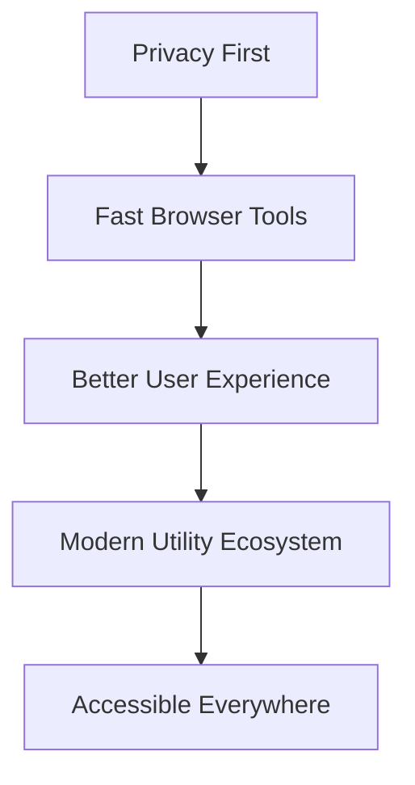
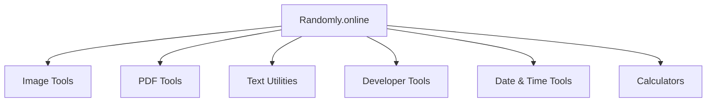
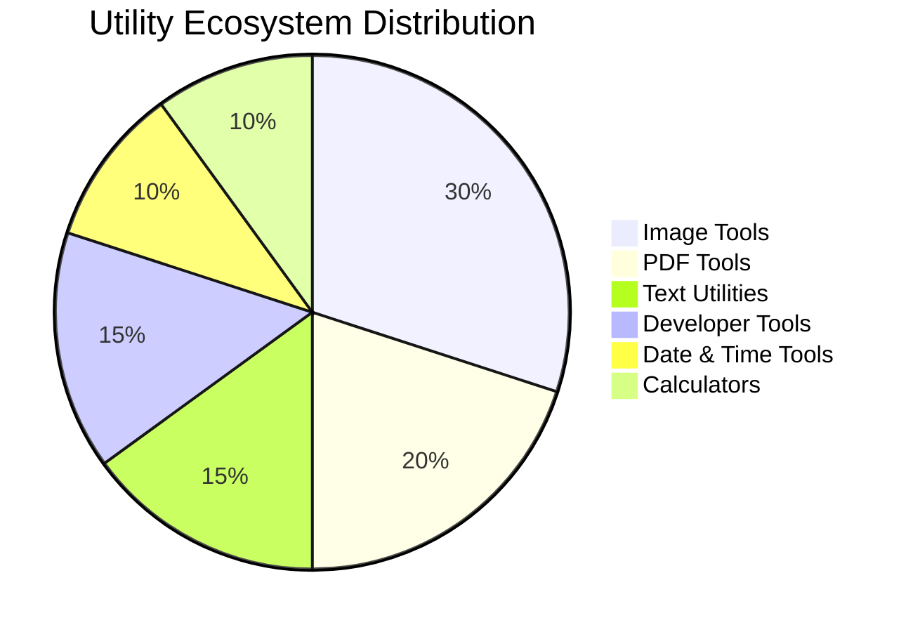
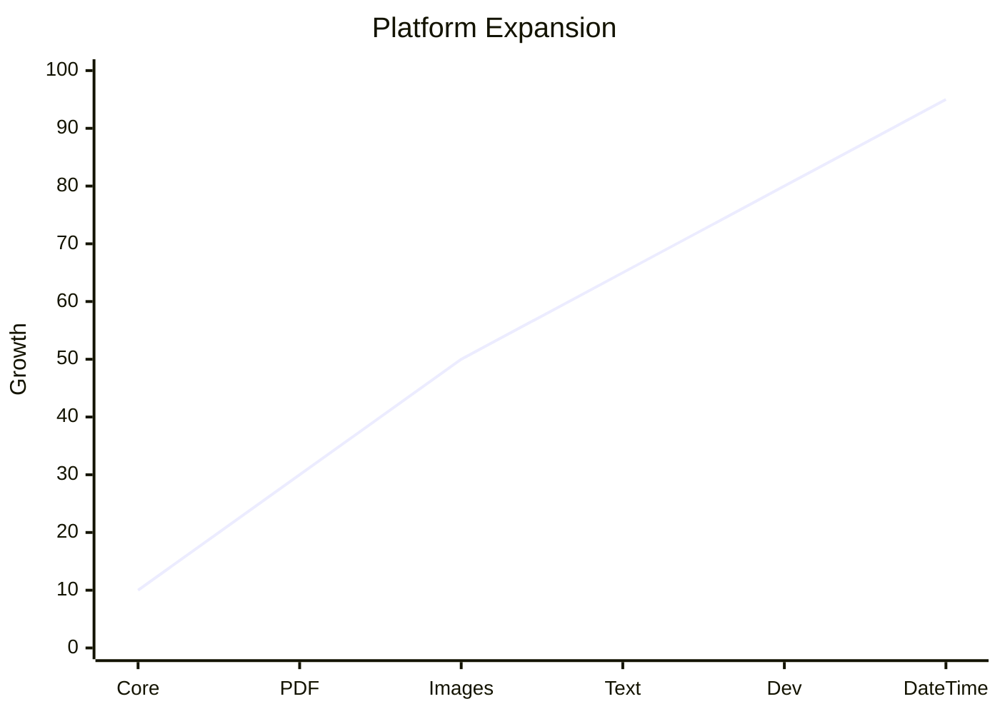
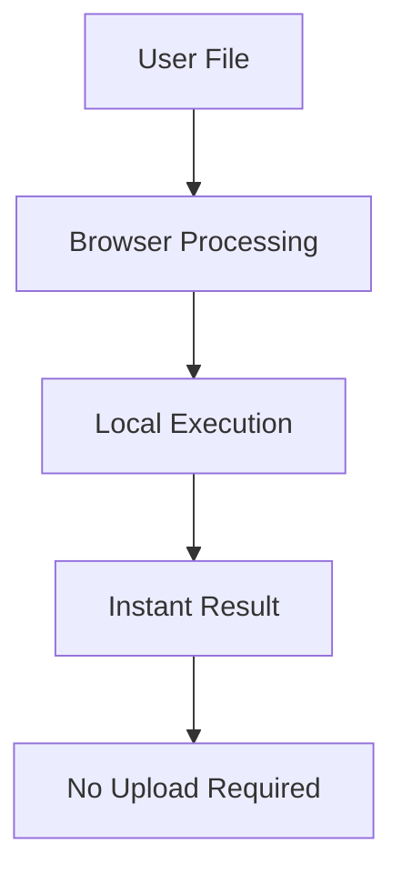
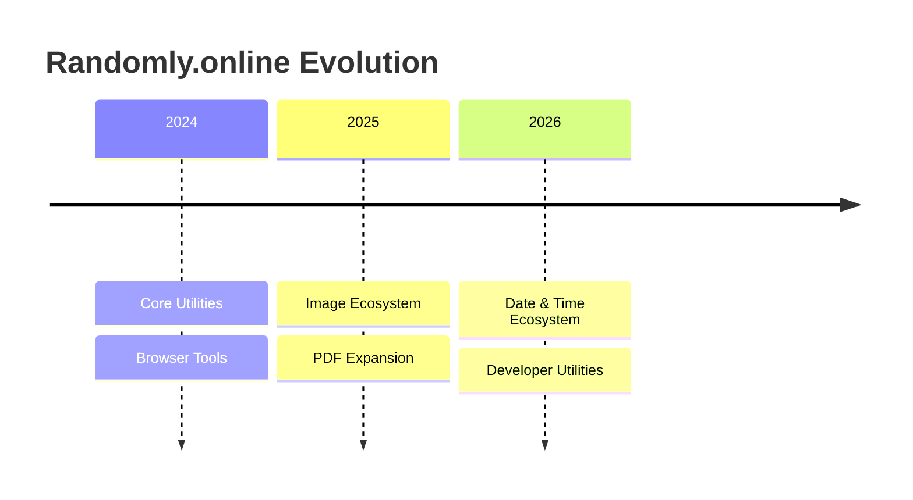
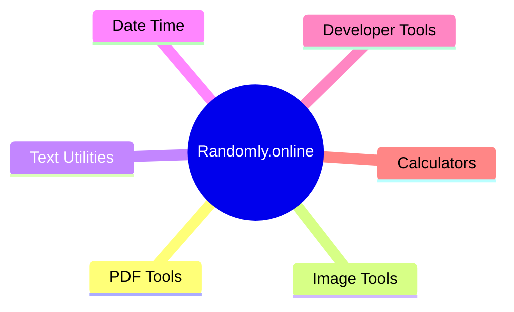
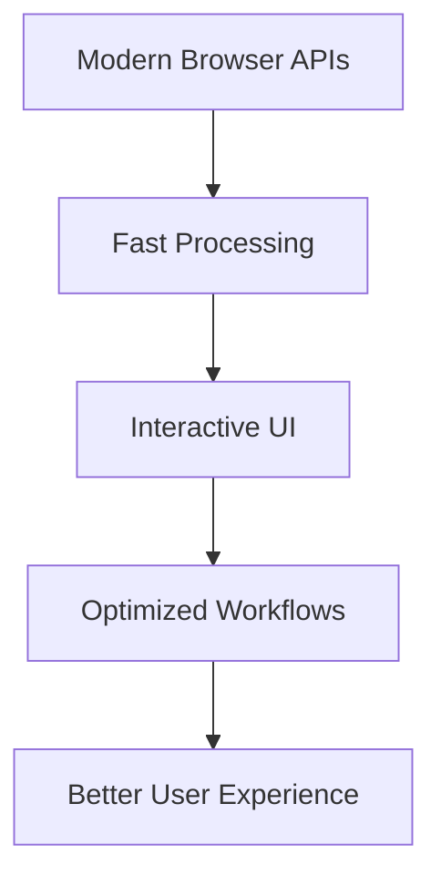
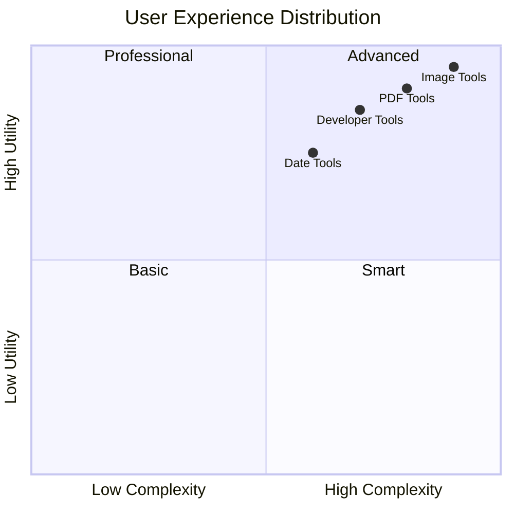

<div align="center">

# 🚀 Randomly.online

### ⚡ Fast • Private • Browser-Based Utility Ecosystem

<p align="center">
  
  
  
</p>

<p align="center">
  
  
  
  
</p>

### 🌐 https://randomly.online

---


</div>

# ✨ About Randomly.online

Randomly.online is a growing ecosystem of modern browser-based utilities designed to make everyday digital tasks faster, simpler and more privacy focused.

The platform is built around a core philosophy:

> Useful online tools should respect user privacy instead of exploiting it.

Unlike many traditional utility platforms, Randomly.online prioritizes **client-side processing whenever possible**, allowing users to process files directly inside their browser without unnecessary uploads.

The platform is continuously expanding with tools across multiple categories including:

- 📄 PDF Tools
- 🖼️ Image Tools
- 🔤 Text Utilities
- 🧮 Calculators
- 📅 Date & Time Tools
- 💻 Developer Utilities
- 🔄 File Conversion Tools
- 🎮 Experimental Browser Experiences

---

# 🔥 Founder Philosophy

<div align="center">

## “I built Randomly.online with a simple belief: useful tools should respect user privacy, not exploit it.”

### ✦ Dhruba Singha Roy

</div>

---

# 🛠️ Tool Ecosystem

<div align="center">

| Category | Features |
|---|---|
| 📄 PDF Tools | Merge, Split, Compress, Watermark, Convert |
| 🖼️ Image Tools | Compress, Resize, Crop, Convert, Optimize |
| 🔤 Text Tools | Word Counter, Formatter, Cleaner, Generators |
| 🧮 Calculators | Financial, Percentage, Age, Unit, Scientific |
| 📅 Date & Time | Countdowns, Clocks, Generators, Converters |
| 💻 Developer Tools | JSON, Base64, Encoding, Formatting Utilities |

</div>

---

# ⚡ Core Features

<div align="center">

| Feature | Description |
|---|---|
| 🔒 Privacy Focused | Files stay on your device whenever possible |
| ⚡ Fast Performance | Lightweight and optimized browser tools |
| 🌍 Cross Platform | Works across desktop and mobile browsers |
| 🚫 No Signups | Instant access without account creation |
| 📱 Mobile Optimized | Responsive modern interface |
| 🧠 Modern UX | Clean and easy-to-use experience |
| 🔄 Constantly Improving | Frequent updates and refinements |
| 🤖 AI Discoverable | Structured for modern AI visibility |

</div>

---

# 🌐 Why Randomly.online Exists

Modern online tools are increasingly becoming:
- bloated
- intrusive
- slow
- overloaded with ads
- dependent on unnecessary uploads

Randomly.online was created to move in the opposite direction.

The goal is to build:
- fast browser utilities
- privacy-focused experiences
- clean UI systems
- accessible digital tools
- scalable utility ecosystems

---


## 🔒 Fully Client-Side Philosophy

Randomly.online is designed around a strong client-side architecture.

Most tools work entirely inside the browser using pure JavaScript, meaning:

- Files stay on your device
- No unnecessary uploads
- No external processing APIs
- Faster local execution
- Better privacy and security
- Reduced dependency on cloud infrastructure

Your data remains under your control whenever possible.

---

# 🧠 Technology Focus

```txt
HTML5
CSS3
JavaScript
Pure JavaScript
Client-Side Processing
Responsive UI/UX
Performance Optimization
No External APIs
```

---

# 📈 Growth Vision

<div align="center">

## Building More Than Just Tools

</div>

Randomly.online is evolving toward a larger interconnected utility ecosystem focused on:

- Privacy-first experiences
- Browser-native workflows
- Fast productivity utilities
- Modern UI/UX systems
- Scalable tool architecture
- AI-friendly utility discovery

---

# 🎯 Current Focus Areas

## 🖼️ Image Ecosystem
- Compression
- Conversion
- Optimization
- Resizing

## 📄 PDF Ecosystem
- Editing
- Compression
- Watermark Utilities
- Conversion

## 🧮 Utility Ecosystem
- Calculators
- Time utilities
- Generators
- Productivity helpers

---

# 📱 Platform Principles

<div align="center">



</div>

---

# 👨‍💻 Founder

## Dhruba Singha Roy

Founder and developer behind Randomly.online.

Focused on:
- browser-based ecosystems
- modern client-side experiences
- scalable utility systems
- privacy-focused engineering

### Connect

- LinkedIn: https://www.linkedin.com/in/dhrubasingharoy
- GitHub: https://github.com/D-xan

---

# 🚀 Future Roadmap

- Advanced PDF processing
- Better image optimization systems
- AI-assisted browser tools
- More calculators
- Improved accessibility
- Faster rendering pipelines
- Browser multiplayer experiments
- Expanded utility ecosystem

---

# 🌍 Platform Highlights

<div align="center">

| Metric | Status |
|---|---|
| 🚀 Growing Tool Ecosystem | Active |
| 🔄 Continuous Updates | Ongoing |
| 🌐 Search Engine Visibility | Expanding |
| 🤖 AI Citation Discovery | Increasing |
| 📱 Mobile Optimization | Enabled |
| 🔒 Privacy Focus | Core Priority |

</div>

---

# ❤️ Built With Purpose

<div align="center">

### Fast. Private. Useful.

### Building a modern utility ecosystem for the open web.

<br>

# 🌐 https://randomly.online

</div>

---

# 📜 License

MIT License

---

<div align="center">


</div>


---

# 🌌 Interactive Ecosystem Visualization

<div align="center">


</div>

<div align="center">



</div>

---

# 📊 Utility Distribution Graph

<div align="center">



</div>

---

# ⚡ Platform Performance Matrix

<div align="center">

| Feature | Performance |
|---|---|
| ⚡ Browser Speed | ████████████████ 95% |
| 🔒 Privacy Architecture | ████████████████ 100% |
| 📱 Mobile Optimization | ██████████████ 92% |
| 🌍 Accessibility | █████████████ 88% |
| 🧠 Modern UI/UX | ███████████████ 96% |

</div>

---

# 🌍 Browser Utility Workflow

<div align="center">


</div>

---

# 📈 Ecosystem Growth Visualization

<div align="center">



</div>

---

# 🧠 Modern Utility Stack

<div align="center">

```txt
HTML5
CSS3
JavaScript
Client-Side Rendering
Canvas APIs
Responsive UI Systems
Performance Optimization
Privacy-Focused Architecture
```

</div>

---

# 🌐 Privacy Architecture

<div align="center">



</div>

---

# 🚀 Ecosystem Timeline

<div align="center">



</div>

---

# 📱 Platform Compatibility

<div align="center">

| Platform | Support |
|---|---|
| Windows | ✅ |
| Android | ✅ |
| Linux | ✅ |
| macOS | ✅ |
| iPhone | ✅ |
| Tablets | ✅ |

</div>

---

# 🔥 Utility Categories

<div align="center">



</div>

---

# 🎨 Visual Performance Layer

<div align="center">


</div>

---

# 📡 Modern Browser Architecture

<div align="center">



</div>

---

# ⚙️ Utility Experience Matrix

<div align="center">



</div>

---

# 🌠 Ecosystem Banner

<div align="center">


</div>

