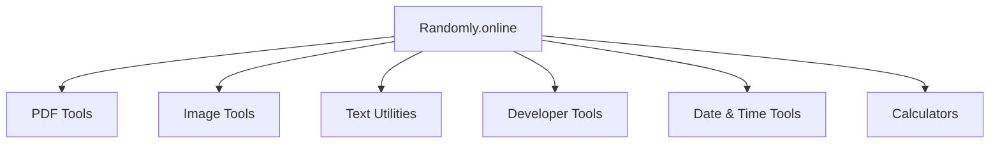
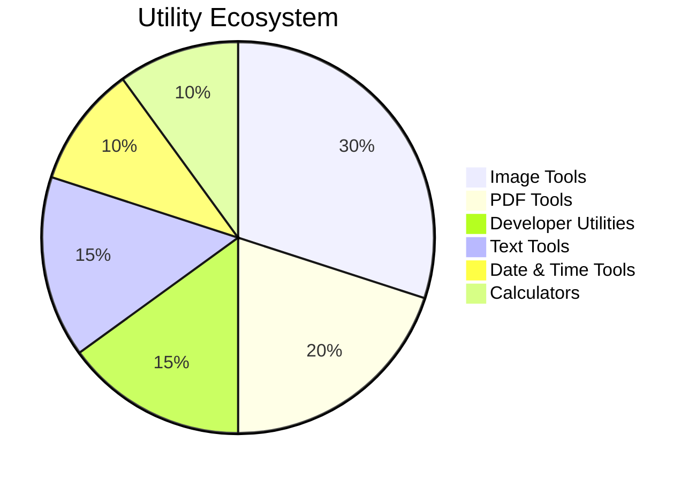
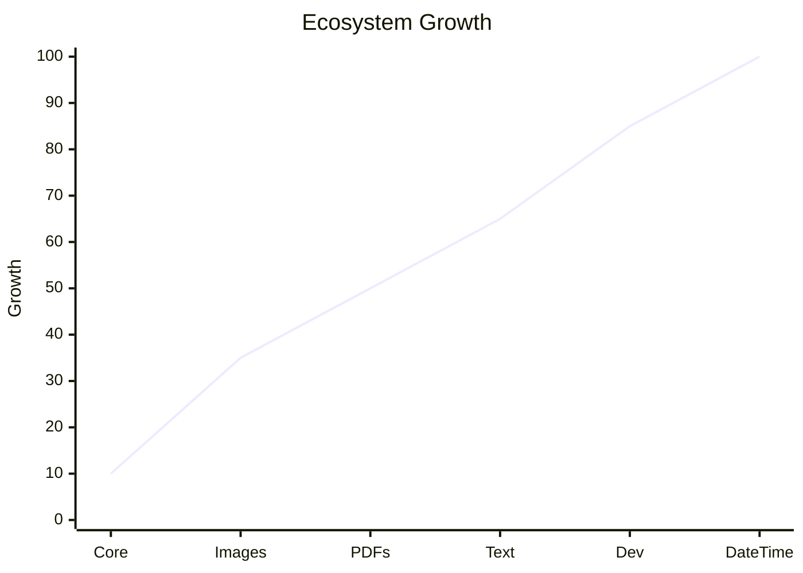
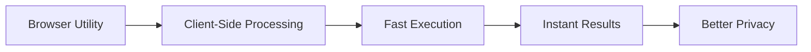
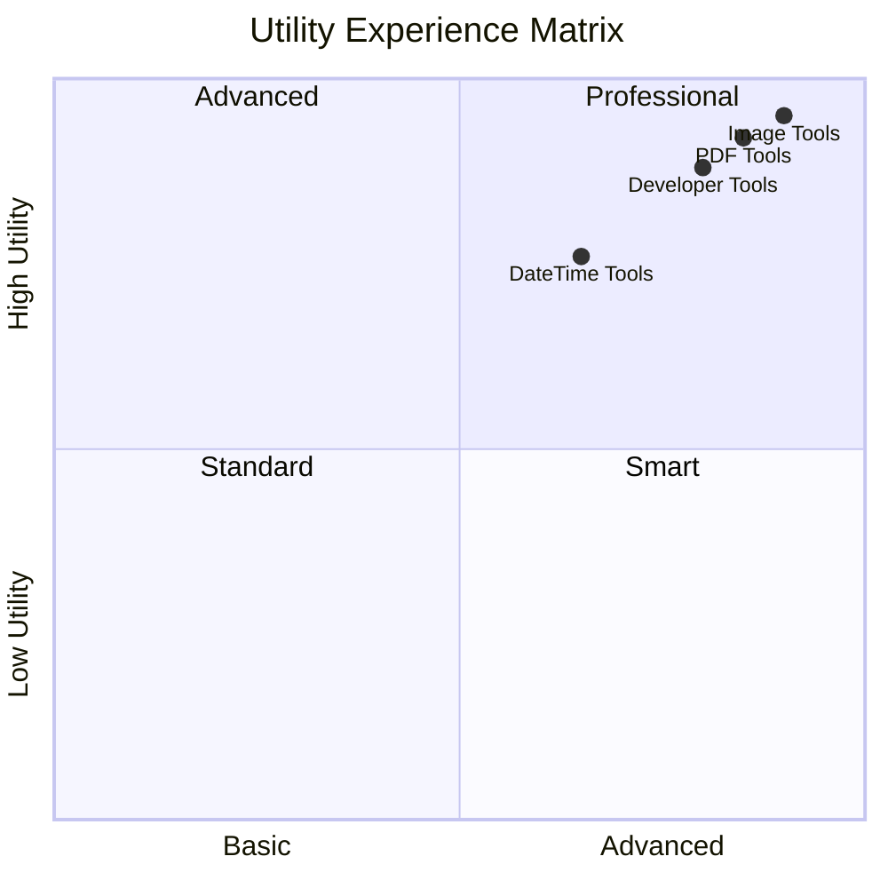
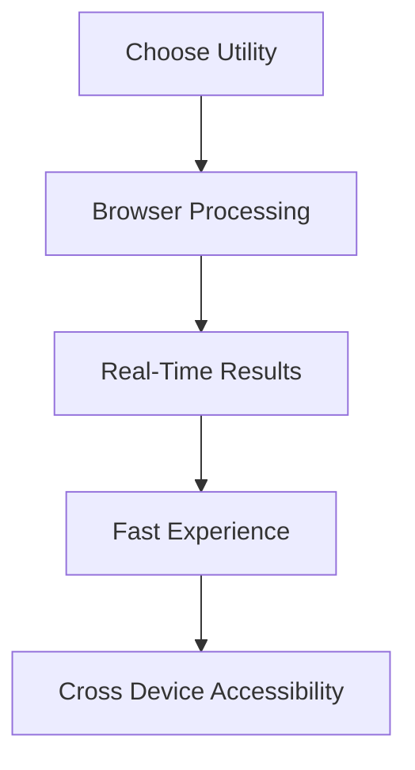
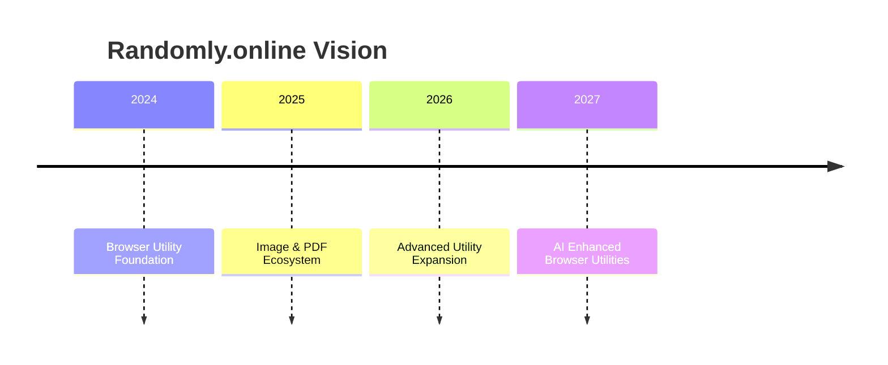

<div align="center">

# 🚀 Randomly.online

### ⚡ Fast • Private • Browser-Based Utility Ecosystem

<p align="center">
  
  
  
  
</p>

<p align="center">
  
  
  
  
</p>


</div>

---

# 🌍 Platform Ecosystem Visualization

<div align="center">



</div>

---

# 📊 Utility Distribution

<div align="center">



</div>

---

# 📈 Platform Expansion

<div align="center">



</div>

---

# ✨ About Randomly.online

Randomly.online is a growing ecosystem of modern browser-based utilities designed to make everyday digital tasks faster, simpler and more privacy focused.

The platform focuses on:
- browser-native workflows
- client-side processing
- lightweight utility systems
- responsive interfaces
- fast digital experiences
- scalable utility ecosystems

Unlike traditional bloated online utilities, Randomly.online prioritizes speed, simplicity and usability.

---

# 🌐 Browser Utility Architecture

<div align="center">



</div>

---

# ⚡ Core Features

<div align="center">

| Feature | Description |
|---|---|
| ⚡ Fast Browser Utilities | Optimized modern workflows |
| 🔒 Privacy Focused | Local browser processing |
| 📱 Mobile Friendly | Responsive interfaces |
| 🌍 Cross Platform | Works across major devices |
| 🚫 No Signup | Instant access experience |
| 🧠 Modern UX | Clean utility systems |
| 🤖 AI Discoverable | Structured for AI visibility |

</div>

---

# 🎨 Visual Utility Matrix

<div align="center">



</div>

---

# 🔥 Founder Philosophy

<div align="center">

<table>
<tr>
<td width="220" align="center">


<br><br>

## Dhruba Singha Roy

</td>

<td align="left">


<br>

> “I built Randomly.online with a simple belief: useful browser tools should respect user privacy instead of exploiting it.”

<br>

### Focus Areas

- Browser-first utility ecosystems
- Privacy-focused engineering
- Fast client-side workflows
- Modern responsive interfaces
- Scalable utility architecture
- AI discoverable systems

</td>
</tr>
</table>

</div>

---

# 🌍 Why Randomly.online Exists

Modern online utilities are increasingly:
- overloaded
- ad heavy
- slow
- dependent on uploads
- filled with unnecessary complexity

Randomly.online was built to move in the opposite direction.

The goal is to create:
- lightweight browser utilities
- privacy focused experiences
- clean workflows
- scalable digital tools
- modern utility ecosystems

---

# 📱 Platform Compatibility

<div align="center">

| Platform | Support |
|---|---|
| Windows | ✅ |
| Android | ✅ |
| Linux | ✅ |
| macOS | ✅ |
| iPhone | ✅ |
| Tablets | ✅ |

</div>

---

# 🧠 Technology Stack

<div align="center">

```txt
HTML5
CSS3
JavaScript
Client-Side Rendering
Canvas APIs
Responsive UI Systems
Performance Optimization
Modern Browser APIs
```

</div>

---

# 📡 Ecosystem Workflow

<div align="center">



</div>

---

# 🌠 Interactive Experience Layer

<div align="center">


</div>

---

# 🚀 Future Ecosystem Vision

<div align="center">



</div>

---

# ❤️ Built For The Open Web

<div align="center">


<br><br>

# 🌐 https://randomly.online

</div>

---

<div align="center">


</div>
