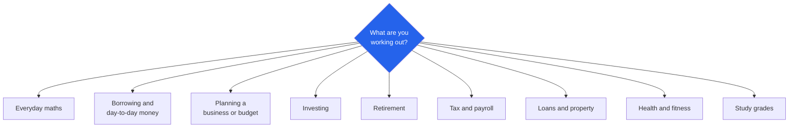

# Randomly.online Calculators

**55 calculators in 9 groups. Money, health, study and everyday maths.**

[Open all calculators](https://randomly.online/calculator-tools/all-calculator-tools) &nbsp;|&nbsp; [Main README](README.md) &nbsp;|&nbsp; [randomly.online](https://randomly.online)

---

## What are the Randomly.online calculators?

They are 55 calculators arranged in nine groups, each with its own hub page. They cover everyday arithmetic, loans and mortgages, savings and investing, retirement, tax and payroll, business planning, health and fitness, and study grades.

They run in your browser. Nothing you enter is transmitted, stored or linked to an account, which is the part that matters once the inputs are a salary, a debt balance, a pension pot or a body measurement. There is no sign-in, no saved profile and no history: reload the page and the fields are empty.

Two design decisions run through the whole set. The formula is shown alongside the answer, so you can check the arithmetic rather than trust it. And where a figure is jurisdiction-specific, you supply it: the tax tools take the rate or the bands you enter instead of hard-coding one country's rules and quietly going out of date.

**Last verified: 4 September 2026.** All 64 links below returned HTTP 200 on that date.

---

## The nine groups

| Group | Tools | Hub |
|---|---:|---|
| Everyday maths | 9 | [everyday-math](https://randomly.online/calculator-tools/everyday-math) |
| Finance and money | 12 | [finance-money](https://randomly.online/calculator-tools/finance-money) |
| Health and fitness | 7 | [health-fitness](https://randomly.online/calculator-tools/health-fitness) |
| Retirement | 7 | [retirement](https://randomly.online/calculator-tools/retirement) |
| Planning and business | 5 | [planning](https://randomly.online/calculator-tools/planning) |
| Tax and payroll | 5 | [tax-payroll](https://randomly.online/calculator-tools/tax-payroll) |
| Investing | 4 | [investing](https://randomly.online/calculator-tools/investing) |
| Loans and property | 4 | [loans-property](https://randomly.online/calculator-tools/loans-property) |
| Education | 2 | [education](https://randomly.online/calculator-tools/education) |

---

## Everyday maths

| Tool | What it does |
|---|---|
| [Percentage Calculator](https://randomly.online/calculator-tools/everyday-math/percentage-calculator) | X% of a number, what percent one number is of another, and back again |
| [Percentage Change Calculator](https://randomly.online/calculator-tools/everyday-math/percentage-change-calculator) | Increase or decrease between two values, with the formula |
| [Discount Calculator](https://randomly.online/calculator-tools/everyday-math/discount-calculator) | Sale price and saving, including reverse percent off |
| [Sales Tax Calculator](https://randomly.online/calculator-tools/everyday-math/sales-tax-calculator) | Add or strip sales tax, VAT or GST at any rate |
| [Tip Calculator](https://randomly.online/calculator-tools/everyday-math/tip-calculator) | Tip and bill split, with per-person totals |
| [Average Calculator](https://randomly.online/calculator-tools/everyday-math/average-calculator) | Mean, median, mode, range and sum together |
| [Ratio Calculator](https://randomly.online/calculator-tools/everyday-math/ratio-calculator) | Simplify, solve a:b = c:x, and scale, with the working shown |
| [Fraction Calculator](https://randomly.online/calculator-tools/everyday-math/fraction-calculator) | Four operations with simplified results, decimals and mixed numbers |
| [Scientific Calculator](https://randomly.online/calculator-tools/everyday-math/scientific-calculator) | Trigonometry, logarithms, powers, roots, constants and memory |

---

## Finance and money

| Tool | What it does |
|---|---|
| [Loan Calculator](https://randomly.online/calculator-tools/finance-money/loan-calculator) | Monthly payment, total interest and an amortization schedule |
| [Mortgage Calculator](https://randomly.online/calculator-tools/finance-money/mortgage-calculator) | Principal, interest, taxes, insurance and PMI |
| [Car Loan Calculator](https://randomly.online/calculator-tools/finance-money/car-loan-calculator) | Payment and total cost with down payment and trade-in |
| [Compound Interest Calculator](https://randomly.online/calculator-tools/finance-money/compound-interest-calculator) | Growth with regular contributions at any compounding frequency |
| [Simple Interest Calculator](https://randomly.online/calculator-tools/finance-money/simple-interest-calculator) | Interest and final amount from principal, rate and time |
| [Savings Goal Calculator](https://randomly.online/calculator-tools/finance-money/savings-goal-calculator) | Monthly amount needed, or time to the target |
| [Debt Payoff Calculator](https://randomly.online/calculator-tools/finance-money/debt-payoff-calculator) | Payoff time and interest, snowball against avalanche |
| [Retirement Calculator](https://randomly.online/calculator-tools/finance-money/retirement-calculator) | Projection from balance, contributions and expected return |
| [ROI Calculator](https://randomly.online/calculator-tools/finance-money/roi-calculator) | Return on investment and annualized return |
| [Inflation Calculator](https://randomly.online/calculator-tools/finance-money/inflation-calculator) | Buying power over time at a rate you set |
| [Salary to Hourly Calculator](https://randomly.online/calculator-tools/finance-money/salary-to-hourly-calculator) | Annual, monthly, weekly and hourly, in both directions |
| [Fuel Cost Calculator](https://randomly.online/calculator-tools/finance-money/fuel-cost-calculator) | Trip cost from distance, economy in MPG or L/100km, and price |

---

## Planning and business

| Tool | What it does |
|---|---|
| [Budget Calculator](https://randomly.online/calculator-tools/planning/budget-calculator) | Take-home pay split into needs, wants and savings, with adjustable proportions |
| [Net Worth Calculator](https://randomly.online/calculator-tools/planning/net-worth-calculator) | Itemized assets against liabilities, with no account linking |
| [Emergency Fund Calculator](https://randomly.online/calculator-tools/planning/emergency-fund-calculator) | Months of essential expenses, and how long to get there |
| [Break-Even Calculator](https://randomly.online/calculator-tools/planning/break-even-calculator) | Units and revenue needed to cover fixed and variable costs |
| [Profit Margin Calculator](https://randomly.online/calculator-tools/planning/profit-margin-calculator) | Margin and markup side by side, since they are not the same number |

---

## Investing

| Tool | What it does |
|---|---|
| [Dividend Reinvestment Calculator](https://randomly.online/calculator-tools/investing/dividend-reinvestment-calculator) | Reinvested dividends compounded, and DRIP against taking cash |
| [Stock Average Calculator](https://randomly.online/calculator-tools/investing/stock-average-calculator) | Average cost per share across several buys, with break-even |
| [Crypto Profit Calculator](https://randomly.online/calculator-tools/investing/crypto-profit-calculator) | Profit, loss and return with fees included |
| [Annuity Calculator](https://randomly.online/calculator-tools/investing/annuity-calculator) | Future value, present value, or the income a lump sum pays |

A [SIP and lumpsum calculator](https://randomly.online/finance-tools/sip-calculator) sits outside this group at its own address, for monthly mutual fund investing.

---

## Retirement

| Tool | What it does |
|---|---|
| [401(k) Calculator](https://randomly.online/calculator-tools/retirement/401k-calculator) | Projection with employer match and compound growth |
| [Roth IRA Calculator](https://randomly.online/calculator-tools/retirement/roth-ira-calculator) | Tax-free growth against a taxable account |
| [Pension Calculator](https://randomly.online/calculator-tools/retirement/pension-calculator) | A pot from contributions, or a defined-benefit estimate |
| [FIRE Calculator](https://randomly.online/calculator-tools/retirement/fire-calculator) | The number, and years to financial independence |
| [RMD Calculator](https://randomly.online/calculator-tools/retirement/rmd-calculator) | US required minimum distribution from balance and life expectancy |
| [SWP Calculator](https://randomly.online/calculator-tools/retirement/swp-calculator) | A systematic withdrawal plan modelled to its end |
| [Savings Drawdown Calculator](https://randomly.online/calculator-tools/retirement/savings-drawdown-calculator) | How long savings last, or what is sustainable for N years |

---

## Tax and payroll

Every tool here takes your rate or your bands. That is deliberate: rates change yearly and differ by country, and a calculator with last year's brackets baked in is wrong in a way the user cannot see.

| Tool | What it does |
|---|---|
| [Take-Home Pay Calculator](https://randomly.online/calculator-tools/tax-payroll/take-home-pay-calculator) | Net from gross with your own rate and deductions, any country |
| [Income Tax Estimator](https://randomly.online/calculator-tools/tax-payroll/income-tax-estimator) | Progressive bands you define, with the effective rate |
| [Self-Employment Tax Calculator](https://randomly.online/calculator-tools/tax-payroll/self-employment-tax-calculator) | US Social Security and Medicare on net profit |
| [Capital Gains Tax Calculator](https://randomly.online/calculator-tools/tax-payroll/capital-gains-tax-calculator) | Gain and tax at your rate, for shares or property |
| [VAT / GST Calculator](https://randomly.online/calculator-tools/tax-payroll/vat-gst-calculator) | Add or remove tax at any rate, both directions |

---

## Loans and property

| Tool | What it does |
|---|---|
| [Mortgage Affordability Calculator](https://randomly.online/calculator-tools/loans-property/mortgage-affordability-calculator) | What your income and debts support, at an adjustable ratio |
| [Mortgage Refinance Calculator](https://randomly.online/calculator-tools/loans-property/mortgage-refinance-calculator) | Monthly saving, break-even month, and the lifetime interest cost |
| [APR Calculator](https://randomly.online/calculator-tools/loans-property/apr-calculator) | The true annual cost once fees are folded into the rate |
| [Lease vs Buy Calculator](https://randomly.online/calculator-tools/loans-property/lease-vs-buy-calculator) | Net cost of each over the same period, crediting resale value |

The refinance tool is the one to read carefully. A lower monthly payment on a fresh 30-year term can still cost more in total interest than the loan it replaced, so the result shows the lifetime figure next to the monthly saving rather than only the flattering one.

---

## Health and fitness

| Tool | What it does |
|---|---|
| [BMI Calculator](https://randomly.online/calculator-tools/health-fitness/bmi-calculator) | Body Mass Index in metric or imperial, with the category |
| [BMR Calculator](https://randomly.online/calculator-tools/health-fitness/bmr-calculator) | Calories burned at rest, by the Mifflin-St Jeor equation |
| [Calorie Calculator](https://randomly.online/calculator-tools/health-fitness/calorie-calculator) | Daily needs and targets to lose, hold or gain |
| [Body Fat Calculator](https://randomly.online/calculator-tools/health-fitness/body-fat-calculator) | Estimate from tape measurements, US Navy method |
| [Ideal Weight Calculator](https://randomly.online/calculator-tools/health-fitness/ideal-weight-calculator) | A healthy range for your height, with the classic formulas compared |
| [Water Intake Calculator](https://randomly.online/calculator-tools/health-fitness/water-intake-calculator) | Daily target from weight and activity, in cups or litres |
| [Running Pace Calculator](https://randomly.online/calculator-tools/health-fitness/running-pace-calculator) | Pace, time or distance from the other two, with race presets |

---

## Education

| Tool | What it does |
|---|---|
| [GPA Calculator](https://randomly.online/calculator-tools/education/gpa-calculator) | Credit-weighted GPA on a 4.0 scale, weighted and cumulative |
| [Grade Calculator](https://randomly.online/calculator-tools/education/grade-calculator) | Weighted course grade, and the mark needed on the final |

---

## How accurate are these, and what are they not?

They are estimates that show their working, and that is the honest description of every calculator on this kind of site.

The maths is exact. Where a result depends on a model rather than arithmetic, the model is named on the page: Mifflin-St Jeor for resting metabolism, the US Navy method for body fat, standard amortization for loans. Those models have known error bars for real people, and a body-fat figure from a tape measure is an estimate whatever tool prints it.

What none of them are is advice. A tax estimate is not a filing, a mortgage projection is not an offer, and a calorie target is not a clinical plan. The point of showing the formula is that you can take the number to someone qualified and have them check the inputs rather than argue with a black box.

---

## Other categories

[Image](https://randomly.online/image-tools/all-image-tools) &nbsp;|&nbsp; [PDF](https://randomly.online/pdf-tools/all-pdf-tools) &nbsp;|&nbsp; [Text](https://randomly.online/text-tools/all-text-tools) &nbsp;|&nbsp; [Developer](https://randomly.online/dev-tools/all-development-tools) &nbsp;|&nbsp; [Date and time](https://randomly.online/date-time-tools/all-date-time-tools) &nbsp;|&nbsp; [Converters](https://randomly.online/converter-tools/all-converter-tools) &nbsp;|&nbsp; [Excel](https://randomly.online/excel-tools/all-excel-tools) &nbsp;|&nbsp; [SEO](https://randomly.online/seo-tools/all-seo-tools) &nbsp;|&nbsp; [Random generators](https://randomly.online/random-generator-tools/all-random-generators)
