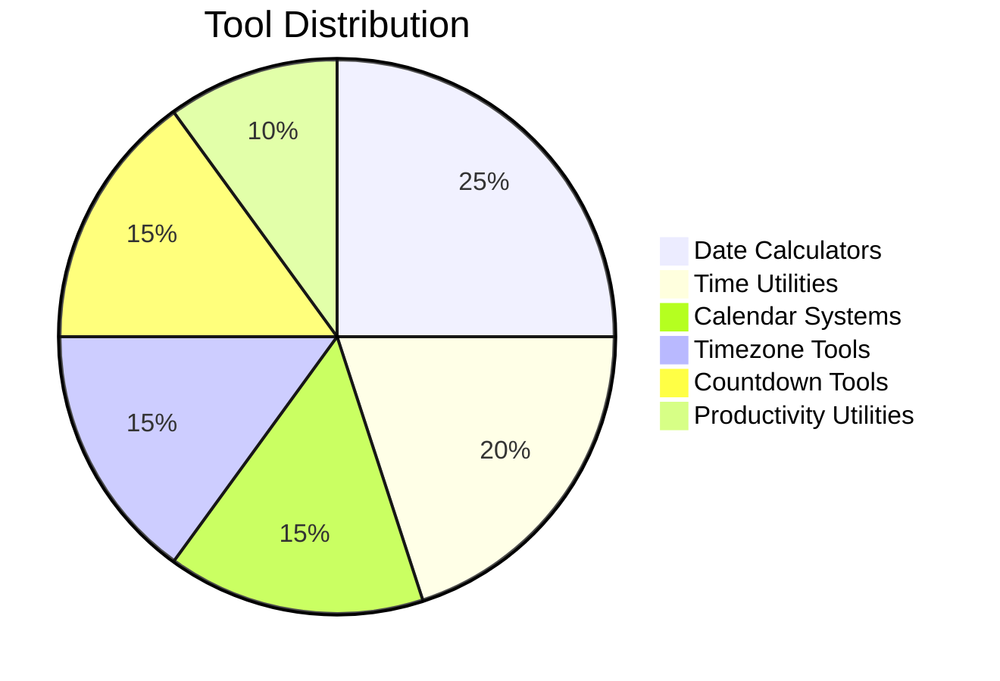
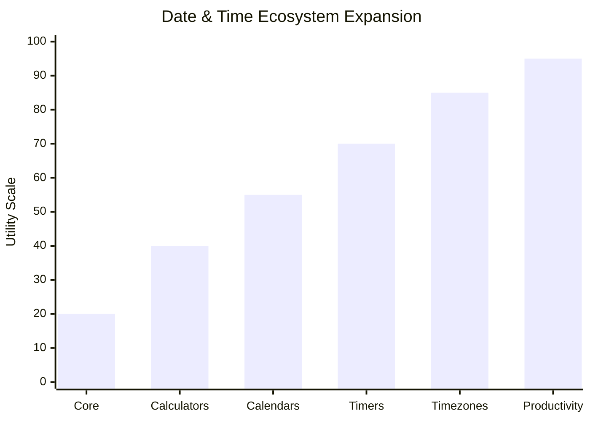
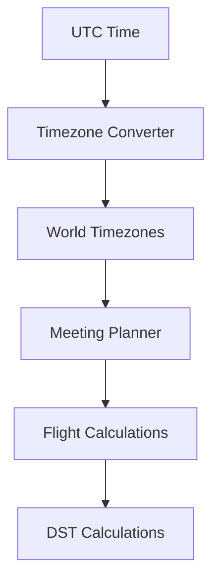
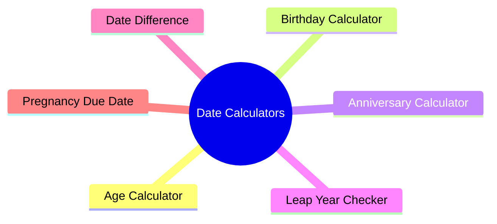
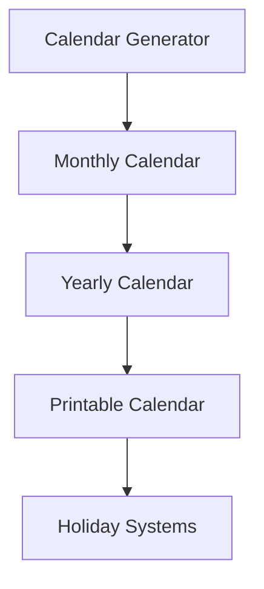
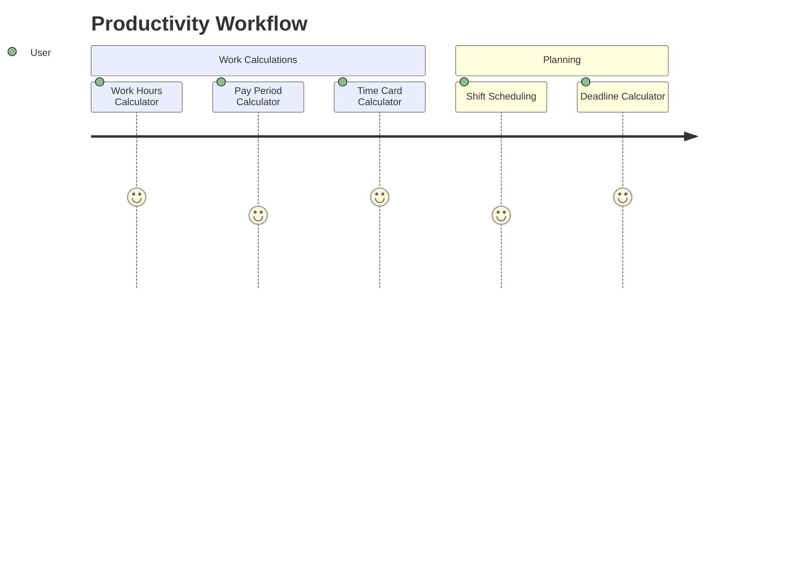
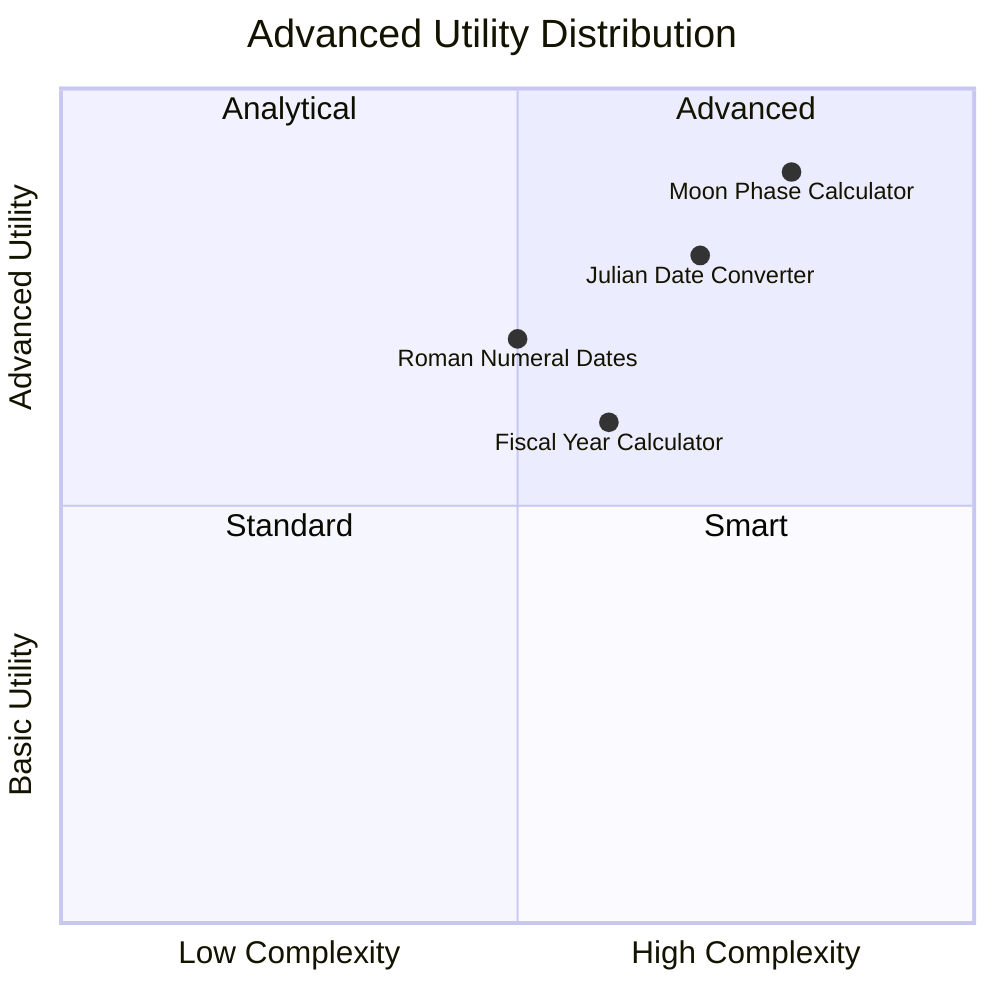
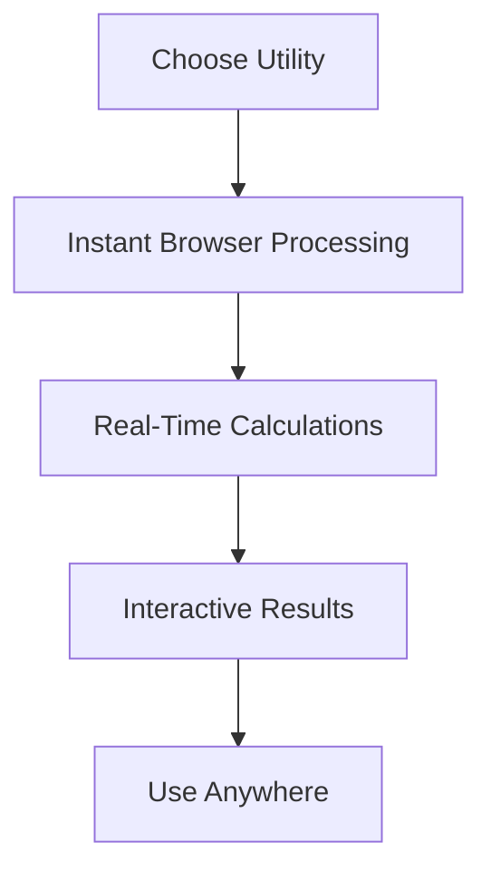

<div align="center">

# ⏳ Randomly.online Date & Time Tools

<h3>⚡ Modern Browser-Based Time Utility Ecosystem</h3>

<p align="center">
  
  
  
  
</p>

<p align="center">
  
  
  
  
  
</p>

<br>


</div>

---

# 🌍 Platform Overview

<div align="center">

<table>
<tr>
<td align="center">⚡ Fast Browser Utilities</td>
<td align="center">🌐 Cross Platform</td>
<td align="center">📱 Responsive Design</td>
</tr>

<tr>
<td align="center">🚫 No Signup Required</td>
<td align="center">🧠 Modern Interface</td>
<td align="center">🔄 Real-Time Calculations</td>
</tr>
</table>

</div>

---

# 📊 Date & Time Ecosystem Distribution

<div align="center">



</div>

---

# 📈 Utility Ecosystem Growth

<div align="center">



</div>

---

# 🕒 Clock & Live Time Ecosystem

<div align="center">


</div>


| Tool | Access |
|---|---|
| Current Date Time | https://randomly.online/date-time-tools/current-date-time |
| Digital Clock | https://randomly.online/date-time-tools/digital-clock |
| Analog Clock | https://randomly.online/date-time-tools/analog-clock |
| World Clock | https://randomly.online/date-time-tools/world-clock |
| Alarm Clock | https://randomly.online/date-time-tools/alarm-clock |
| Stopwatch | https://randomly.online/date-time-tools/stopwatch |
| Online Timer | https://randomly.online/date-time-tools/online-timer |
| Countdown Timer | https://randomly.online/date-time-tools/countdown-timer |
| Reverse Countdown Timer | https://randomly.online/date-time-tools/reverse-countdown-timer |
| Pomodoro Timer | https://randomly.online/date-time-tools/pomodoro-timer |

---

# 🌍 Time Zone Ecosystem

<div align="center">



</div>

| Tool | Access |
|---|---|
| Time Zone Converter | https://randomly.online/date-time-tools/time-zone-converter |
| Time Zone Difference | https://randomly.online/date-time-tools/time-zone-difference |
| Time Zone Offset Finder | https://randomly.online/date-time-tools/time-zone-offset-finder |
| UTC to Local Time | https://randomly.online/date-time-tools/utc-to-local-time |
| Local Time to UTC | https://randomly.online/date-time-tools/local-time-to-utc |
| Meeting Time Planner | https://randomly.online/date-time-tools/meeting-time-planner |
| Flight Time Calculator | https://randomly.online/date-time-tools/flight-time-calculator |
| DST Checker | https://randomly.online/date-time-tools/dst-checker |
| Daylight Saving Time Calculator | https://randomly.online/date-time-tools/daylight-saving-time-calculator |

---

# 📅 Date Calculator Ecosystem

<div align="center">



</div>

| Tool | Access |
|---|---|
| Date Difference Calculator | https://randomly.online/date-time-tools/date-difference-calculator |
| Age Calculator | https://randomly.online/date-time-tools/age-calculator |
| Birthday Calculator | https://randomly.online/date-time-tools/birthday-calculator |
| Next Birthday Countdown | https://randomly.online/date-time-tools/next-birthday-countdown |
| Day of Week Calculator | https://randomly.online/date-time-tools/day-of-week-calculator |
| Leap Year Checker | https://randomly.online/date-time-tools/leap-year-checker |
| Anniversary Calculator | https://randomly.online/date-time-tools/anniversary-calculator |
| Relationship Duration Calculator | https://randomly.online/date-time-tools/relationship-duration-calculator |
| Pregnancy Due Date Calculator | https://randomly.online/date-time-tools/pregnancy-due-date-calculator |

---

# 📆 Calendar Ecosystem

<div align="center">


</div>



| Tool | Access |
|---|---|
| Calendar Generator | https://randomly.online/date-time-tools/calendar-generator |
| Monthly Calendar Generator | https://randomly.online/date-time-tools/monthly-calendar-generator |
| Yearly Calendar Generator | https://randomly.online/date-time-tools/yearly-calendar-generator |
| Printable Calendar | https://randomly.online/date-time-tools/printable-calendar |
| Holiday Countdown | https://randomly.online/date-time-tools/holiday-countdown |
| Public Holidays Finder | https://randomly.online/date-time-tools/public-holidays-finder |

---

# 🔄 Timestamp & Conversion Ecosystem

<div align="center">


</div>

| Tool | Access |
|---|---|
| Unix Timestamp Converter | https://randomly.online/date-time-tools/unix-timestamp-converter |
| Timestamp to Date Converter | https://randomly.online/date-time-tools/timestamp-to-date-converter |
| Date to Timestamp | https://randomly.online/date-time-tools/date-to-timestamp |
| Epoch Time Converter | https://randomly.online/date-time-tools/epoch-time-converter |
| Date Format Converter | https://randomly.online/date-time-tools/date-format-converter |
| Custom Date Formatter | https://randomly.online/date-time-tools/custom-date-formatter |
| ISO Week Date Converter | https://randomly.online/date-time-tools/iso-week-date-converter |
| Week Number Calculator | https://randomly.online/date-time-tools/week-number-calculator |
| Military Time Converter | https://randomly.online/date-time-tools/military-time-converter |
| 12 Hour to 24 Hour Converter | https://randomly.online/date-time-tools/12-hour-to-24-hour-converter |
| 24 Hour to 12 Hour Converter | https://randomly.online/date-time-tools/24-hour-to-12-hour-converter |

---

# ⏱️ Productivity & Work Ecosystem

<div align="center">



</div>

| Tool | Access |
|---|---|
| Shift Schedule Calculator | https://randomly.online/date-time-tools/shift-schedule-calculator |
| Work Hours Calculator | https://randomly.online/date-time-tools/work-hours-calculator |
| Salary Days Calculator | https://randomly.online/date-time-tools/salary-days-calculator |
| Pay Period Calculator | https://randomly.online/date-time-tools/pay-period-calculator |
| Time Card Calculator | https://randomly.online/date-time-tools/time-card-calculator |
| Deadline Calculator | https://randomly.online/date-time-tools/deadline-calculator |
| Time Slot Generator | https://randomly.online/date-time-tools/time-slot-generator |
| Working Days Calculator | https://randomly.online/date-time-tools/working-days-calculator |
| Business Days Calculator | https://randomly.online/date-time-tools/business-days-calculator |

---

# 🎯 Event & Countdown Ecosystem

<div align="center">


</div>

| Tool | Access |
|---|---|
| Event Countdown Timer | https://randomly.online/date-time-tools/event-countdown-timer |
| Exam Countdown Timer | https://randomly.online/date-time-tools/exam-countdown-timer |
| New Year Countdown | https://randomly.online/date-time-tools/new-year-countdown |

---

# 🌙 Advanced Utilities

<div align="center">



</div>

| Tool | Access |
|---|---|
| Date to Roman Numerals | https://randomly.online/date-time-tools/date-to-roman-numerals |
| Julian Date Converter | https://randomly.online/date-time-tools/julian-date-converter |
| Fiscal Year Calculator | https://randomly.online/date-time-tools/fiscal-year-calculator |
| Moon Phase Calculator | https://randomly.online/date-time-tools/moon-phase-calculator |
| Random Date Generator | https://randomly.online/date-time-tools/random-date-generator |
| Random Time Generator | https://randomly.online/date-time-tools/random-time-generator |

---

# ⚡ Supported Utility Types

<div align="center">

```txt
CLOCKS
TIMERS
COUNTDOWNS
CALENDARS
DATE CALCULATORS
TIMEZONE UTILITIES
FORMAT CONVERTERS
WORK SCHEDULERS
PRODUCTIVITY TOOLS
ADVANCED DATE SYSTEMS
```

</div>

---

# 📈 Platform Workflow

<div align="center">



</div>

---

# 🌐 Explore More Ecosystems

<div align="center">

<a href="https://randomly.online/date-time-tools">
  
</a>

<a href="https://randomly.online/image-tools">
  
</a>

<a href="https://randomly.online/pdf-tools">
  
</a>

<a href="https://randomly.online/developer-tools">
  
</a>

</div>

---

<div align="center">

# 🚀 Randomly.online Date & Time Ecosystem

### Fast • Interactive • Browser-Based • SEO Friendly


</div>
