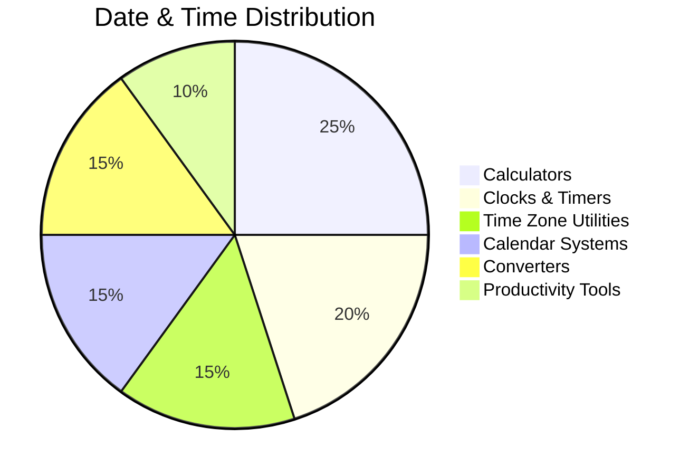
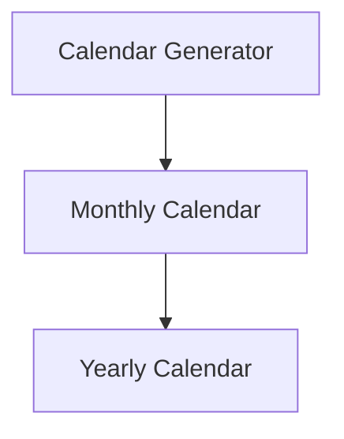

# ⏳ Randomly.online Date & Time Tools

### ⚡ Modern Browser-Based Time Utility Ecosystem

  
  
  

  
  
  
  

---

# 📊 Date & Time Ecosystem

---

# 🕒 Clock & Timer Utilities

| Tool | Launch |
|---|---|
| Current Date Time | https://randomly.online/date-time-tools/current-date-time |
| Digital Clock | https://randomly.online/date-time-tools/digital-clock |
| Analog Clock | https://randomly.online/date-time-tools/analog-clock |
| World Clock | https://randomly.online/date-time-tools/world-clock |
| Countdown Timer | https://randomly.online/date-time-tools/countdown-timer |
| Stopwatch | https://randomly.online/date-time-tools/stopwatch |
| Alarm Clock | https://randomly.online/date-time-tools/alarm-clock |
| Pomodoro Timer | https://randomly.online/date-time-tools/pomodoro-timer |

---

# 🌍 Time Zone Ecosystem

| Tool | Launch |
|---|---|
| Time Zone Converter | https://randomly.online/date-time-tools/time-zone-converter |
| Time Zone Difference | https://randomly.online/date-time-tools/time-zone-difference |
| UTC to Local Time | https://randomly.online/date-time-tools/utc-to-local-time |
| Local Time to UTC | https://randomly.online/date-time-tools/local-time-to-utc |
| Meeting Time Planner | https://randomly.online/date-time-tools/meeting-time-planner |

---

# 📅 Date Calculators

| Tool | Launch |
|---|---|
| Age Calculator | https://randomly.online/date-time-tools/age-calculator |
| Birthday Calculator | https://randomly.online/date-time-tools/birthday-calculator |
| Anniversary Calculator | https://randomly.online/date-time-tools/anniversary-calculator |
| Leap Year Checker | https://randomly.online/date-time-tools/leap-year-checker |
| Pregnancy Due Date Calculator | https://randomly.online/date-time-tools/pregnancy-due-date-calculator |

---

# 📆 Calendar Ecosystem

| Tool | Launch |
|---|---|
| Calendar Generator | https://randomly.online/date-time-tools/calendar-generator |
| Monthly Calendar Generator | https://randomly.online/date-time-tools/monthly-calendar-generator |
| Yearly Calendar Generator | https://randomly.online/date-time-tools/yearly-calendar-generator |
| Printable Calendar | https://randomly.online/date-time-tools/printable-calendar |

---

# ⏱️ Productivity & Work Tools

| Tool | Launch |
|---|---|
| Work Hours Calculator | https://randomly.online/date-time-tools/work-hours-calculator |
| Pay Period Calculator | https://randomly.online/date-time-tools/pay-period-calculator |
| Shift Schedule Calculator | https://randomly.online/date-time-tools/shift-schedule-calculator |
| Time Card Calculator | https://randomly.online/date-time-tools/time-card-calculator |

---

# 🌙 Advanced Utilities

| Tool | Launch |
|---|---|
| Moon Phase Calculator | https://randomly.online/date-time-tools/moon-phase-calculator |
| Julian Date Converter | https://randomly.online/date-time-tools/julian-date-converter |
| Fiscal Year Calculator | https://randomly.online/date-time-tools/fiscal-year-calculator |
| Random Date Generator | https://randomly.online/date-time-tools/random-date-generator |

---

# 🚀 Randomly.online Date & Time Ecosystem

