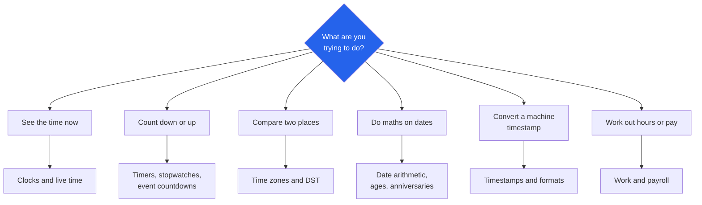

# Randomly.online Date and Time Tools

**74 tools for clocks, time zones, date arithmetic and payroll hours.**

[Open all date and time tools](https://randomly.online/date-time-tools/all-date-time-tools) &nbsp;|&nbsp; [Main README](README.md) &nbsp;|&nbsp; [randomly.online](https://randomly.online)

---

## What are the Randomly.online date and time tools?

They are 74 browser tools covering live clocks, timers and countdowns, time zone conversion, date arithmetic, calendar generation, timestamp conversion and working-hours calculation. All of them run in the tab. Nothing is sent to a server, and nothing needs an account.

Time is the category where a wrong answer is easy to ship and hard to notice, so the awkward cases get handled rather than rounded away. Daylight saving transitions are the usual failure: a meeting planner that ignores them is correct for ten months of the year. Leap years, ISO week numbering, which days count as business days, and the fact that some zones sit at 30 or 45 minute offsets all change results that look simple.

Time zone data comes from a 3.4 MB table of cities served from this site's own `/data/` directory. Your browser is never asked where you are, and no geolocation API is called. You pick a city from a list.

**Last verified: 4 September 2026.** All 74 links below returned HTTP 200 on that date.

---

## Which tool do I need?

---

## Clocks and live time

| Tool | What it does |
|---|---|
| [Current Date and Time](https://randomly.online/date-time-tools/current-date-time) | The date and time where you are, to the second |
| [Digital Clock](https://randomly.online/date-time-tools/digital-clock) | Full-screen digital clock |
| [Analog Clock](https://randomly.online/date-time-tools/analog-clock) | Full-screen analog clock face |
| [World Clock](https://randomly.online/date-time-tools/world-clock) | Several cities side by side, updating live |
| [Sunrise and Sunset Time](https://randomly.online/date-time-tools/sunrise-sunset-time) | Sunrise, sunset and day length for a chosen place and date |
| [Moon Phase Calculator](https://randomly.online/date-time-tools/moon-phase-calculator) | Phase and illumination for any date |

## Timers, stopwatches and alarms

| Tool | What it does |
|---|---|
| [Stopwatch](https://randomly.online/date-time-tools/stopwatch) | Count up, with laps |
| [Online Timer](https://randomly.online/date-time-tools/online-timer) | Set a duration and get an alert |
| [Countdown Timer](https://randomly.online/date-time-tools/countdown-timer) | Count down to zero |
| [Reverse Countdown Timer](https://randomly.online/date-time-tools/reverse-countdown-timer) | Count up from a start point |
| [Pomodoro Timer](https://randomly.online/date-time-tools/pomodoro-timer) | 25 minute work blocks with breaks |
| [Alarm Clock](https://randomly.online/date-time-tools/alarm-clock) | Alarm at a set time, in the browser |

## Countdowns to an event

| Tool | What it does |
|---|---|
| [Event Countdown Timer](https://randomly.online/date-time-tools/event-countdown-timer) | Days, hours and minutes to any date you name |
| [Exam Countdown Timer](https://randomly.online/date-time-tools/exam-countdown-timer) | Countdown built around an exam date |
| [Holiday Countdown](https://randomly.online/date-time-tools/holiday-countdown) | Time left until the next public holiday |
| [New Year Countdown](https://randomly.online/date-time-tools/new-year-countdown) | Time left in the year |
| [Next Birthday Countdown](https://randomly.online/date-time-tools/next-birthday-countdown) | Time until the next birthday |

## Time zones and daylight saving

Nine tools, and the reason there are nine is that "what time is it there" and "will that still be true in March" are different questions.

| Tool | What it does |
|---|---|
| [Time Zone Converter](https://randomly.online/date-time-tools/time-zone-converter) | A time in one zone shown in another |
| [Time Difference Between Time Zones](https://randomly.online/date-time-tools/time-zone-difference) | The gap in hours between two zones right now |
| [Time Zone Offset Finder](https://randomly.online/date-time-tools/time-zone-offset-finder) | The UTC offset for a city, including 30 and 45 minute zones |
| [UTC to Local Time](https://randomly.online/date-time-tools/utc-to-local-time) | UTC -> your zone |
| [Local Time to UTC](https://randomly.online/date-time-tools/local-time-to-utc) | Your zone -> UTC |
| [Meeting Time Planner](https://randomly.online/date-time-tools/meeting-time-planner) | A slot that works across several cities at once |
| [Flight Time Calculator](https://randomly.online/date-time-tools/flight-time-calculator) | Arrival time in local terms, across the zone change |
| [DST Checker](https://randomly.online/date-time-tools/dst-checker) | Whether a place is on daylight saving today, and when it next changes |
| [Daylight Saving Time Calculator](https://randomly.online/date-time-tools/daylight-saving-time-calculator) | DST transition dates for a chosen year |

## Date arithmetic

| Tool | What it does |
|---|---|
| [Date Difference Calculator](https://randomly.online/date-time-tools/date-difference-calculator) | Days, weeks, months and years between two dates |
| [Add Days to Date](https://randomly.online/date-time-tools/add-days-to-date) | Date plus a number of days |
| [Add Months to Date](https://randomly.online/date-time-tools/add-months-to-date) | Date plus months, handling short months |
| [Add Years to Date](https://randomly.online/date-time-tools/add-years-to-date) | Date plus years, handling 29 February |
| [Subtract Days from Date](https://randomly.online/date-time-tools/subtract-days-from-date) | Date minus a number of days |
| [Day of Week Calculator](https://randomly.online/date-time-tools/day-of-week-calculator) | Which weekday a date falls on |
| [Week Number Calculator](https://randomly.online/date-time-tools/week-number-calculator) | ISO 8601 week number |
| [Leap Year Checker](https://randomly.online/date-time-tools/leap-year-checker) | Whether a year is a leap year, with the rule shown |
| [Time Duration Calculator](https://randomly.online/date-time-tools/time-duration-calculator) | Length between two clock times |

## Ages, birthdays and anniversaries

| Tool | What it does |
|---|---|
| [Age Calculator](https://randomly.online/date-time-tools/age-calculator) | Exact age in years, months and days |
| [Birthday Calculator](https://randomly.online/date-time-tools/birthday-calculator) | Weekday of a birth date and upcoming birthdays |
| [Anniversary Calculator](https://randomly.online/date-time-tools/anniversary-calculator) | Time since a date, and the next milestone |
| [Relationship Duration Calculator](https://randomly.online/date-time-tools/relationship-duration-calculator) | Length of a relationship broken down by unit |
| [Pregnancy Due Date Calculator](https://randomly.online/date-time-tools/pregnancy-due-date-calculator) | Estimated due date and current week |
| [Period Calculator](https://randomly.online/date-time-tools/period-calculator) | Cycle dates from a last period and cycle length |

Both of the last two deserve the client-side note in bold. Nothing entered into them is transmitted or stored, and closing the tab discards it.

## Calendars

| Tool | What it does |
|---|---|
| [Calendar Generator](https://randomly.online/date-time-tools/calendar-generator) | A calendar for any month or year |
| [Monthly Calendar Generator](https://randomly.online/date-time-tools/monthly-calendar-generator) | One month, styled for printing |
| [Yearly Calendar Generator](https://randomly.online/date-time-tools/yearly-calendar-generator) | A full year on one sheet |
| [Printable Calendar](https://randomly.online/date-time-tools/printable-calendar) | Print or export as PNG and PDF |
| [Public Holidays Finder](https://randomly.online/date-time-tools/public-holidays-finder) | Public holidays for a country and year |

## Timestamps and date formats

Twelve conversions, because machine time and human time disagree in more than one way.

| Tool | What it does |
|---|---|
| [Unix Timestamp Converter](https://randomly.online/date-time-tools/unix-timestamp-converter) | Unix seconds <-> a readable date |
| [Timestamp to Date Converter](https://randomly.online/date-time-tools/timestamp-to-date-converter) | Timestamp -> date |
| [Date to Timestamp Converter](https://randomly.online/date-time-tools/date-to-timestamp) | Date -> timestamp |
| [Epoch Time Converter](https://randomly.online/date-time-tools/epoch-time-converter) | Seconds and milliseconds since 1 January 1970 |
| [Date Format Converter](https://randomly.online/date-time-tools/date-format-converter) | Between DD/MM/YYYY, MM/DD/YYYY, ISO and others |
| [Custom Date Formatter](https://randomly.online/date-time-tools/custom-date-formatter) | Build a format string and see it applied |
| [ISO Week Date Converter](https://randomly.online/date-time-tools/iso-week-date-converter) | ISO 8601 week date form |
| [Julian Date Converter](https://randomly.online/date-time-tools/julian-date-converter) | Julian day number, as used in astronomy |
| [Date to Roman Numerals](https://randomly.online/date-time-tools/date-to-roman-numerals) | A date written in Roman numerals |
| [Military Time Converter](https://randomly.online/date-time-tools/military-time-converter) | Military and 24 hour notation |
| [12 Hour to 24 Hour Converter](https://randomly.online/date-time-tools/12-hour-to-24-hour-converter) | 12 hour -> 24 hour |
| [24 Hour to 12 Hour Converter](https://randomly.online/date-time-tools/24-hour-to-12-hour-converter) | 24 hour -> 12 hour |

## Work, payroll and scheduling

| Tool | What it does |
|---|---|
| [Work Hours Calculator](https://randomly.online/date-time-tools/work-hours-calculator) | Hours worked from start, end and break times |
| [Working Days Calculator](https://randomly.online/date-time-tools/working-days-calculator) | Working days between two dates |
| [Business Days Calculator](https://randomly.online/date-time-tools/business-days-calculator) | Business days, excluding weekends and holidays |
| [Overtime Calculator](https://randomly.online/date-time-tools/overtime-calculator) | Overtime hours and pay above a threshold |
| [Time Card Calculator](https://randomly.online/date-time-tools/time-card-calculator) | A weekly timesheet totalled up |
| [Shift Schedule Calculator](https://randomly.online/date-time-tools/shift-schedule-calculator) | Rotating shift patterns |
| [Salary Days Calculator](https://randomly.online/date-time-tools/salary-days-calculator) | Payable days in a period |
| [Pay Period Calculator](https://randomly.online/date-time-tools/pay-period-calculator) | Weekly, fortnightly, semi-monthly and monthly periods |
| [Deadline Calculator](https://randomly.online/date-time-tools/deadline-calculator) | A deadline a number of working days out |
| [Fiscal Year Calculator](https://randomly.online/date-time-tools/fiscal-year-calculator) | Which fiscal year and quarter a date falls in |
| [Time Slot Generator](https://randomly.online/date-time-tools/time-slot-generator) | Even slots across a window, for booking sheets |

## Validators and random dates

| Tool | What it does |
|---|---|
| [Date Validator](https://randomly.online/date-time-tools/date-validator) | Whether a string is a real date, and in what format |
| [Time Validator](https://randomly.online/date-time-tools/time-validator) | Whether a string is a valid time |
| [Random Date Generator](https://randomly.online/date-time-tools/random-date-generator) | Random dates in a range, for test data |
| [Random Time Generator](https://randomly.online/date-time-tools/random-time-generator) | Random times in a range |
| [Time Randomizer Tool](https://randomly.online/date-time-tools/time-randomizer-tool) | Shuffle or pick from a set of times |

---

## Do timers keep running if I switch tabs?

Yes for the arithmetic, and this is a real difference between implementations. Browsers throttle `setInterval` in a background tab, sometimes to once a minute, so a timer that counts down by subtracting one on every tick loses time whenever you look away. The countdown, online, event and Pomodoro timers store a target timestamp and subtract `Date.now()` from it on each repaint, so the number on screen is read from the clock rather than accumulated. The repaint interval only controls how smooth it looks. Switch away for ten minutes and come back, and the countdown is where it should be.

Alerts are a separate matter. A background tab can be throttled hard enough to delay a sound, and some browsers block audio until you have interacted with the page. Click once in the tab after setting a long timer.

---

## Other categories

[Image](https://randomly.online/image-tools/all-image-tools) &nbsp;|&nbsp; [PDF](https://randomly.online/pdf-tools/all-pdf-tools) &nbsp;|&nbsp; [Text](https://randomly.online/text-tools/all-text-tools) &nbsp;|&nbsp; [Developer](https://randomly.online/dev-tools/all-development-tools) &nbsp;|&nbsp; [Calculators](https://randomly.online/calculator-tools/all-calculator-tools) &nbsp;|&nbsp; [Converters](https://randomly.online/converter-tools/all-converter-tools) &nbsp;|&nbsp; [Excel](https://randomly.online/excel-tools/all-excel-tools) &nbsp;|&nbsp; [SEO](https://randomly.online/seo-tools/all-seo-tools) &nbsp;|&nbsp; [Random generators](https://randomly.online/random-generator-tools/all-random-generators)
