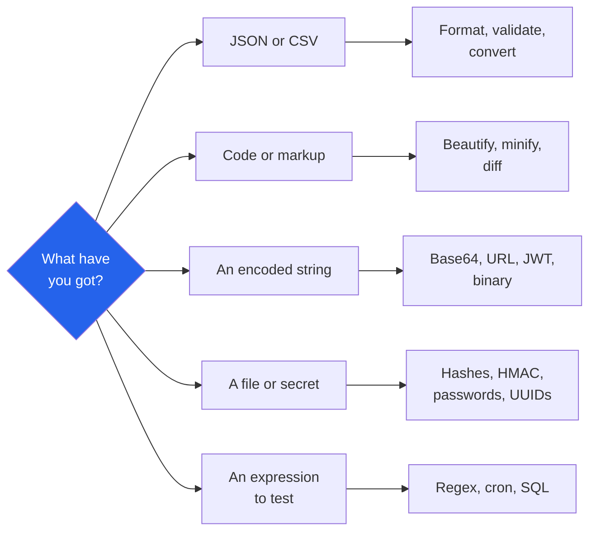

# Randomly.online Developer Tools

**33 developer tools. Formatters, encoders, hashes and a SQL playground.**

[Open all developer tools](https://randomly.online/dev-tools/all-development-tools) &nbsp;|&nbsp; [Main README](README.md) &nbsp;|&nbsp; [randomly.online](https://randomly.online)

---

## What are the Randomly.online developer tools?

They are 33 tools for the small jobs that interrupt real work: formatting a payload someone pasted into a ticket, decoding a token to see why it expired, hashing a file to check a download, testing a regex against the string that broke it.

All of them run in the tab. That is not a marketing line in this category, it is the reason the tools are usable at work. A production JSON payload, a JWT from a staging environment, an SQL query with real column names and a config file are all things people paste into the first formatter a search returns, and most of those formatters post the text to a server. Here the text is parsed by JavaScript in your own browser, so pasting a payload from work is not an exfiltration event.

**Last verified: 4 September 2026.** All 33 links below returned HTTP 200 on that date.

---

## Which tool do I need?

---

## JSON and CSV

| Tool | What it does |
|---|---|
| [JSON Formatter](https://randomly.online/dev-tools/json-formatter) | Beautify, validate and explore, with the error position pointed at |
| [JSON Validator](https://randomly.online/dev-tools/json-validator) | Structural diagnostics and repair of broken JSON |
| [JSON Minifier](https://randomly.online/dev-tools/json-minifier) | Strip whitespace to the smallest valid output, with the saving shown |
| [CSV to JSON](https://randomly.online/dev-tools/csv-to-json) | Header row becomes keys, each row an object, with delimiter handling |
| [JSON to CSV](https://randomly.online/dev-tools/json-to-csv) | Keys become the header, with nested objects flattened |
| [JSON Auto Fill Generator](https://randomly.online/dev-tools/fill-json) | Populate empty or null values with plausible sample data |

The auto fill is for building a fixture out of a real response: take the shape, drop the values, and get something you can commit to a test without shipping anyone's data with it.

---

## Formatting and minifying

| Tool | What it does |
|---|---|
| [HTML Formatter](https://randomly.online/dev-tools/html-formatter) | Indent by nesting, at your chosen width |
| [CSS Formatter](https://randomly.online/dev-tools/css-formatter) | One declaration per line, consistent spacing |
| [JavaScript Formatter](https://randomly.online/dev-tools/javascript-formatter) | Beautify and unminify |
| [SQL Formatter](https://randomly.online/dev-tools/sql-formatter) | Clauses on their own lines, tidy keyword case |
| [XML Formatter](https://randomly.online/dev-tools/xml-formatter) | Indent, catch parse errors, and walk the tree |
| [HTML Minifier](https://randomly.online/dev-tools/html-minifier) | Drop comments and collapse whitespace |
| [CSS Minifier](https://randomly.online/dev-tools/css-minifier) | Strip comments and tighten syntax |
| [JavaScript Minifier](https://randomly.online/dev-tools/javascript-minifier) | Shrink while keeping behaviour |
| [Code Diff Checker](https://randomly.online/dev-tools/code-diff-checker) | Two blocks compared side by side or inline |

---

## Encoding and decoding

| Tool | What it does |
|---|---|
| [Base64 Encoder and Decoder](https://randomly.online/dev-tools/base64-encoder-decoder) | Text, images and binary files, both directions |
| [URL Encoder and Decoder](https://randomly.online/dev-tools/url-encoder-decoder) | Percent-encode a URL or unpick a query string |
| [Text to Binary Converter](https://randomly.online/dev-tools/text-to-binary-converter) | Text to binary and back |
| [JWT Decoder](https://randomly.online/dev-tools/jwt-decoder) | Header, payload and expiry read out of a token |
| [Color Code Converter](https://randomly.online/dev-tools/color-code-converter) | HEX, RGB and HSL, kept in sync |
| [Markdown to HTML](https://randomly.online/dev-tools/markdown-to-html) | Markdown rendered to clean HTML |
| [HTML to Markdown](https://randomly.online/dev-tools/html-to-markdown) | Headings, links, lists, code and tables mapped back |

The JWT decoder is worth one paragraph. A JWT is signed, not encrypted: anyone holding the token can read its payload, which is why a decoder is useful and why a decoder that uploads the token is a bad idea. This one decodes locally and does not verify the signature, because verifying would mean holding your secret. Decode to see the claims and the expiry, verify in your own service.

---

## Hashes, secrets and identifiers

| Tool | What it does |
|---|---|
| [Hash Generator](https://randomly.online/dev-tools/hash-generator) | MD5, SHA-1, SHA-256, SHA-384 and SHA-512 of text, live |
| [File Hash Generator](https://randomly.online/dev-tools/file-hash-generator) | The same digests for a file, to check a download |
| [HMAC Generator](https://randomly.online/dev-tools/hmac-generator) | HMAC-SHA256, HMAC-SHA512 and others with your key |
| [Password Generator](https://randomly.online/dev-tools/password-generator) | Passwords and passphrases with adjustable rules |
| [UUID Generator](https://randomly.online/dev-tools/uuid-generator) | Versions 1, 3, 4 and 5 |

Two things follow from where these run. The file hash never sends the file, so hashing a 2 GB ISO to compare it with a published checksum is a local read rather than an upload. And a generated password is produced by your browser's cryptographic random source and exists only on your screen, which is the only arrangement under which a password generated on a web page is worth using. HMAC keys are the same story: yours is never transmitted.

---

## Testing and exploring

| Tool | What it does |
|---|---|
| [Regex Tester](https://randomly.online/dev-tools/regex-tester) | Live matches, capture groups, named groups and a replace preview |
| [Cron Expression Explainer](https://randomly.online/dev-tools/cron-expression-explainer) | A schedule read back in English, with the next run times |
| [SQL Playground](https://randomly.online/dev-tools/sql-playground) | Real SQL against sample databases, running in the browser |
| [Unix Timestamp Converter](https://randomly.online/dev-tools/unix-timestamp-converter) | Epoch to a readable date and back |
| [Lorem Ipsum Generator](https://randomly.online/dev-tools/lorem-ipsum-generator) | Placeholder text by paragraph, sentence or word |
| [XML Batch Generator from Excel](https://randomly.online/dev-tools/excel-to-xml-folder) | Bulk XML files from a spreadsheet and a template |

The SQL playground runs a real database engine compiled to WebAssembly inside the page. Queries execute against sample data on your machine, so there is nothing to connect to, nothing to rate limit, and nothing that can reach a server you did not mean to query. Useful for teaching, for checking join syntax, and for trying something you would not run against production.

---

## Do these work offline?

Yes, once the site has been visited. The site is an installable progressive web app with a service worker, so tools you have opened before keep working with no connection. For a category people reach for on a plane or in a locked-down office, that is often the difference between using it and not.

---

## Other categories

[Image](https://randomly.online/image-tools/all-image-tools) &nbsp;|&nbsp; [PDF](https://randomly.online/pdf-tools/all-pdf-tools) &nbsp;|&nbsp; [Text](https://randomly.online/text-tools/all-text-tools) &nbsp;|&nbsp; [Date and time](https://randomly.online/date-time-tools/all-date-time-tools) &nbsp;|&nbsp; [Calculators](https://randomly.online/calculator-tools/all-calculator-tools) &nbsp;|&nbsp; [Converters](https://randomly.online/converter-tools/all-converter-tools) &nbsp;|&nbsp; [Excel](https://randomly.online/excel-tools/all-excel-tools) &nbsp;|&nbsp; [SEO](https://randomly.online/seo-tools/all-seo-tools) &nbsp;|&nbsp; [Random generators](https://randomly.online/random-generator-tools/all-random-generators)
