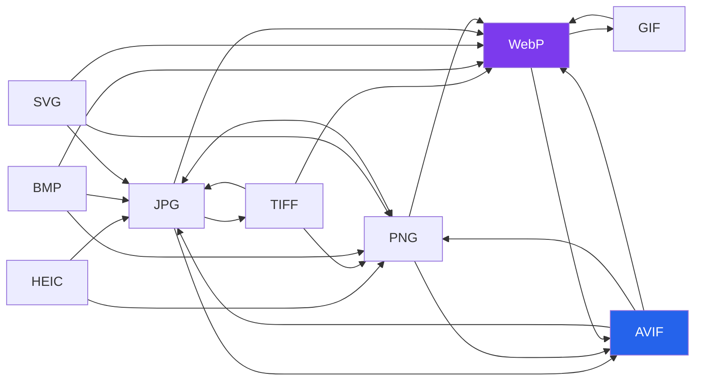

# Randomly.online Image Tools

**47 image tools. Ten formats. Nothing uploaded.**

[Open all image tools](https://randomly.online/image-tools/all-image-tools) &nbsp;|&nbsp; [Main README](README.md) &nbsp;|&nbsp; [randomly.online](https://randomly.online)

---

## What are the Randomly.online image tools?

They are 47 browser-based tools for converting, editing and inspecting images, covering PNG, JPG, WebP, AVIF, HEIC, SVG, BMP, TIFF, GIF and Base64. Each one runs entirely in the tab using the Canvas API and, for the formats browsers cannot decode natively, WebAssembly. Your photo is read from disk by the browser, changed in memory, and written back out as a download.

No file is transmitted. There is no upload progress bar because there is no upload, no queue and no account, and no size cap beyond what your own machine will hold. A 40 MB TIFF works if your browser has the memory for it.

The practical consequence people notice first is speed on repeat work. Converting thirty screenshots does not mean thirty round trips to a server. The second consequence matters more if the images are passports, medical scans or contracts: they never sit on hardware you do not control.

**Last verified: 4 September 2026.** All 47 links below returned HTTP 200 on that date.

---

## Which format converts to which?

---

## Editing and creative tools

Fifteen tools that change how an image looks rather than what container it is in.

| Tool | What it does |
|---|---|
| [Image Resizer](https://randomly.online/image-tools/image-resizer) | Resize by pixels or percentage, with aspect ratio locked or free |
| [Image Cropper](https://randomly.online/image-tools/image-cropper) | Freehand and fixed-ratio cropping |
| [Circle Image Cropper](https://randomly.online/image-tools/circle-image-cropper) | Crop to a circle with transparency, for avatars |
| [Image Rotator](https://randomly.online/image-tools/image-rotator) | Rotate and flip |
| [Add Text to Image](https://randomly.online/image-tools/add-text-to-image) | Place captions with font, colour and position control |
| [Add Watermark to Image](https://randomly.online/image-tools/add-watermark-to-image) | Text or image watermark with opacity and tiling |
| [Merge Images](https://randomly.online/image-tools/merge-images) | Join images horizontally or vertically |
| [Photo Collage Maker](https://randomly.online/image-tools/photo-collage) | Grid layouts from several photos |
| [Image Frame Maker](https://randomly.online/image-tools/image-frame) | Add borders and frames |
| [Passport Size Photo Maker](https://randomly.online/image-tools/passport-size-photo) | Country preset sizes for ID photos |
| [Blur Image](https://randomly.online/image-tools/blur-image) | Whole-image or selective blur, for redaction |
| [Image Grayscale Filter](https://randomly.online/image-tools/image-grayscale-filter) | Convert to greyscale |
| [Auto Brightness and Contrast](https://randomly.online/image-tools/autobrightnesscontrast) | Automatic tonal correction |
| [Photo Enhancer](https://randomly.online/image-tools/photo-enhancer) | Sharpness and colour adjustment |
| [Photo to Sketch](https://randomly.online/image-tools/photo-to-sketch) | Pencil sketch effect |

---

## Compression and general conversion

| Tool | What it does |
|---|---|
| [Image Compressor](https://randomly.online/image-tools/image-compressor) | Reduce file size with a quality slider and a live before-and-after size readout |
| [Image Converter](https://randomly.online/image-tools/image-converter) | Convert between the supported formats in one place |
| [GIF Converter](https://randomly.online/image-tools/gif-converter) | Work with animated and still GIFs |

---

## AVIF

AVIF usually produces the smallest file of the modern formats, which is why it has both directions covered.

| Tool | Direction |
|---|---|
| [JPG to AVIF](https://randomly.online/image-tools/jpg-to-avif) | JPG -> AVIF |
| [PNG to AVIF](https://randomly.online/image-tools/png-to-avif) | PNG -> AVIF |
| [WebP to AVIF](https://randomly.online/image-tools/webp-to-avif) | WebP -> AVIF |
| [AVIF to JPG](https://randomly.online/image-tools/avif-to-jpg) | AVIF -> JPG |
| [AVIF to PNG](https://randomly.online/image-tools/avif-to-png) | AVIF -> PNG |
| [AVIF to WebP](https://randomly.online/image-tools/avif-to-webp) | AVIF -> WebP |

---

## WebP

| Tool | Direction |
|---|---|
| [JPG to WebP](https://randomly.online/image-tools/jpg-to-webp) | JPG -> WebP |
| [PNG to WebP](https://randomly.online/image-tools/png-to-webp) | PNG -> WebP |
| [GIF to WebP](https://randomly.online/image-tools/gif-to-webp) | GIF -> WebP |
| [WebP to PNG](https://randomly.online/image-tools/webp-to-png) | WebP -> PNG |
| [WebP to GIF](https://randomly.online/image-tools/webp-to-gif) | WebP -> GIF |

---

## HEIC, the iPhone format

iPhones save photos as HEIC, and most Windows software still will not open one. These three do it without installing a codec pack.

| Tool | What it does |
|---|---|
| [HEIC Viewer](https://randomly.online/image-tools/heic-viewer) | Open and view a HEIC file in the browser |
| [HEIC to JPG](https://randomly.online/image-tools/heic-to-jpg) | HEIC -> JPG |
| [HEIC to PNG](https://randomly.online/image-tools/heic-to-png) | HEIC -> PNG |

---

## SVG, BMP and TIFF

| Tool | Direction |
|---|---|
| [SVG to PNG](https://randomly.online/image-tools/svg-to-png) | SVG -> PNG |
| [SVG to JPG](https://randomly.online/image-tools/svg-to-jpg) | SVG -> JPG |
| [SVG to WebP](https://randomly.online/image-tools/svg-to-webp) | SVG -> WebP |
| [BMP to JPG](https://randomly.online/image-tools/bmp-to-jpg) | BMP -> JPG |
| [BMP to PNG](https://randomly.online/image-tools/bmp-to-png) | BMP -> PNG |
| [BMP to WebP](https://randomly.online/image-tools/bmp-to-webp) | BMP -> WebP |
| [TIFF to JPG](https://randomly.online/image-tools/tiff-to-jpg) | TIFF -> JPG |
| [TIFF to PNG](https://randomly.online/image-tools/tiff-to-png) | TIFF -> PNG |
| [TIFF to WebP](https://randomly.online/image-tools/tiff-to-webp) | TIFF -> WebP |
| [JPG to TIFF](https://randomly.online/image-tools/jpg-to-tiff) | JPG -> TIFF |

---

## PNG and JPG

| Tool | Direction |
|---|---|
| [PNG to JPG](https://randomly.online/image-tools/png-to-jpg) | PNG -> JPG, with a background colour for transparency |
| [JPG to PNG](https://randomly.online/image-tools/jpg-to-png) | JPG -> PNG |

---

## Base64 and metadata

| Tool | What it does |
|---|---|
| [Image to Base64](https://randomly.online/image-tools/image-to-base64) | Encode an image as a data URI for CSS or HTML |
| [Base64 to Image](https://randomly.online/image-tools/base64-to-image) | Decode a data URI back to a file |
| [Image Metadata Viewer](https://randomly.online/image-tools/image-metadata-viewer) | Read EXIF data, including camera, date and GPS coordinates if present |

The metadata viewer is worth a note. Phone photos often carry the exact location where they were taken, and people share them without knowing. Reading that in a tool that uploads the photo first would be a strange way to learn it, which is the argument for this whole set in one sentence.

---

## Other categories

[PDF](https://randomly.online/pdf-tools/all-pdf-tools) &nbsp;|&nbsp; [Text](https://randomly.online/text-tools/all-text-tools) &nbsp;|&nbsp; [Developer](https://randomly.online/dev-tools/all-development-tools) &nbsp;|&nbsp; [Date and time](https://randomly.online/date-time-tools/all-date-time-tools) &nbsp;|&nbsp; [Calculators](https://randomly.online/calculator-tools/all-calculator-tools) &nbsp;|&nbsp; [Converters](https://randomly.online/converter-tools/all-converter-tools) &nbsp;|&nbsp; [Excel](https://randomly.online/excel-tools/all-excel-tools) &nbsp;|&nbsp; [SEO](https://randomly.online/seo-tools/all-seo-tools) &nbsp;|&nbsp; [Random generators](https://randomly.online/random-generator-tools/all-random-generators)
