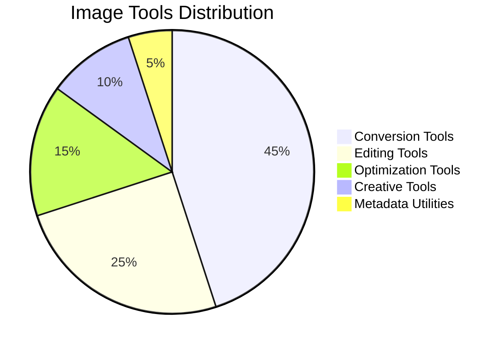
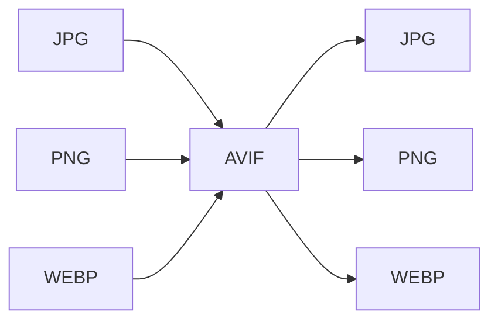
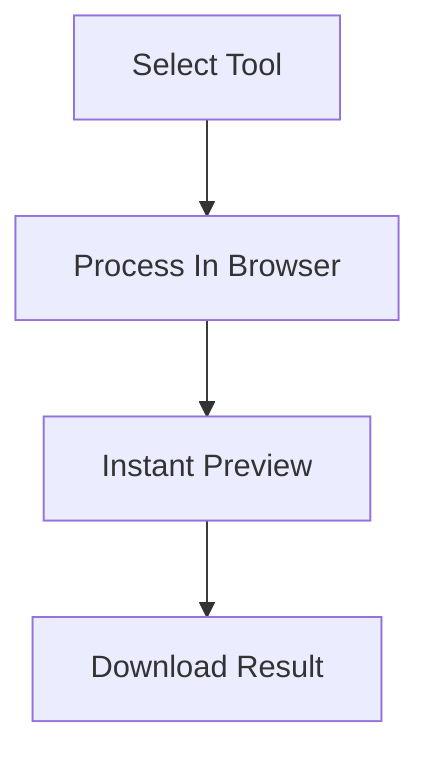

<div align="center">

# 🖼️ Randomly.online Image Tools

### ⚡ Modern Browser-Based Image Utility Ecosystem

<p align="center">
  
  
  
</p>

<p align="center">
  
  
  
  
</p>

<a href="https://randomly.online/image-tools/all-image-tools">
  
</a>

<br><br>


</div>

---

# 📊 Image Tools Ecosystem

<div align="center">



</div>

---

# ⚡ Core Platform Features

<div align="center">

| Feature | Support |
|---|---|
| 🔒 Client-Side Processing | ✅ |
| ⚡ Instant Browser Processing | ✅ |
| 📱 Mobile Friendly | ✅ |
| 🧠 Modern Browser APIs | ✅ |
| 🚫 No Signups Required | ✅ |
| ☁️ Server Upload Dependency | ❌ |
| 💾 Software Installation | ❌ |

</div>

---

# 🖼️ Editing & Creative Tools

<div align="center">

| Tool | Launch |
|---|---|
| Add Text to Image | [🚀 Open](https://randomly.online/image-tools/add-text-to-image) |
| Merge Images | [🚀 Open](https://randomly.online/image-tools/merge-images) |
| Passport Size Photo | [🚀 Open](https://randomly.online/image-tools/passport-size-photo) |
| Image Frame | [🚀 Open](https://randomly.online/image-tools/image-frame) |
| Circle Image Cropper | [🚀 Open](https://randomly.online/image-tools/circle-image-cropper) |
| Add Watermark to Image | [🚀 Open](https://randomly.online/image-tools/add-watermark-to-image) |
| Image Cropper | [🚀 Open](https://randomly.online/image-tools/image-cropper) |
| Blur Image | [🚀 Open](https://randomly.online/image-tools/blur-image) |
| Image Rotator | [🚀 Open](https://randomly.online/image-tools/image-rotator) |
| Photo to Sketch | [🚀 Open](https://randomly.online/image-tools/photo-to-sketch) |
| Auto Brightness Contrast | [🚀 Open](https://randomly.online/image-tools/autobrightnesscontrast) |
| Image Grayscale Filter | [🚀 Open](https://randomly.online/image-tools/image-grayscale-filter) |
| Image Resizer | [🚀 Open](https://randomly.online/image-tools/image-resizer) |
| Photo Collage | [🚀 Open](https://randomly.online/image-tools/photo-collage) |
| Photo Enhancer | [🚀 Open](https://randomly.online/image-tools/photo-enhancer) |

</div>

---

# 🔄 PNG & JPG Conversion Ecosystem

<div align="center">

| Tool | Conversion |
|---|---|
| PNG to JPG | PNG → JPG |
| JPG to PNG | JPG → PNG |
| PNG to WebP | PNG → WebP |
| JPG to WebP | JPG → WebP |
| JPG to TIFF | JPG → TIFF |

</div>

---

# 🚀 AVIF Ecosystem

<div align="center">



</div>

| Tool | Launch |
|---|---|
| JPG to AVIF | [🚀 Open](https://randomly.online/image-tools/jpg-to-avif) |
| PNG to AVIF | [🚀 Open](https://randomly.online/image-tools/png-to-avif) |
| WebP to AVIF | [🚀 Open](https://randomly.online/image-tools/webp-to-avif) |
| AVIF to JPG | [🚀 Open](https://randomly.online/image-tools/avif-to-jpg) |
| AVIF to PNG | [🚀 Open](https://randomly.online/image-tools/avif-to-png) |
| AVIF to WebP | [🚀 Open](https://randomly.online/image-tools/avif-to-webp) |

---

# 🌐 WebP Ecosystem

<div align="center">

| Tool | Launch |
|---|---|
| JPG to WebP | [🚀 Open](https://randomly.online/image-tools/jpg-to-webp) |
| PNG to WebP | [🚀 Open](https://randomly.online/image-tools/png-to-webp) |
| GIF to WebP | [🚀 Open](https://randomly.online/image-tools/gif-to-webp) |
| WebP to PNG | [🚀 Open](https://randomly.online/image-tools/webp-to-png) |
| WebP to GIF | [🚀 Open](https://randomly.online/image-tools/webp-to-gif) |

</div>

---

# 📱 HEIC Ecosystem

<div align="center">

| Tool | Launch |
|---|---|
| HEIC Viewer | [🚀 Open](https://randomly.online/image-tools/heic-viewer) |
| HEIC to JPG | [🚀 Open](https://randomly.online/image-tools/heic-to-jpg) |
| HEIC to PNG | [🚀 Open](https://randomly.online/image-tools/heic-to-png) |

</div>

---

# 🧩 SVG Ecosystem

<div align="center">

| Tool | Launch |
|---|---|
| SVG to PNG | [🚀 Open](https://randomly.online/image-tools/svg-to-png) |
| SVG to JPG | [🚀 Open](https://randomly.online/image-tools/svg-to-jpg) |
| SVG to WebP | [🚀 Open](https://randomly.online/image-tools/svg-to-webp) |

</div>

---

# 🎞️ GIF Ecosystem

<div align="center">

| Tool | Launch |
|---|---|
| GIF Converter | [🚀 Open](https://randomly.online/image-tools/gif-converter) |
| GIF to WebP | [🚀 Open](https://randomly.online/image-tools/gif-to-webp) |
| WebP to GIF | [🚀 Open](https://randomly.online/image-tools/webp-to-gif) |

</div>

---

# 🧱 BMP Ecosystem

<div align="center">

| Tool | Launch |
|---|---|
| BMP to JPG | [🚀 Open](https://randomly.online/image-tools/bmp-to-jpg) |
| BMP to PNG | [🚀 Open](https://randomly.online/image-tools/bmp-to-png) |
| BMP to WebP | [🚀 Open](https://randomly.online/image-tools/bmp-to-webp) |

</div>

---

# 🖨️ TIFF Ecosystem

<div align="center">

| Tool | Launch |
|---|---|
| TIFF to JPG | [🚀 Open](https://randomly.online/image-tools/tiff-to-jpg) |
| TIFF to PNG | [🚀 Open](https://randomly.online/image-tools/tiff-to-png) |
| TIFF to WebP | [🚀 Open](https://randomly.online/image-tools/tiff-to-webp) |

</div>

---

# 🧠 Metadata & Utility Tools

<div align="center">

| Tool | Launch |
|---|---|
| Image Metadata Viewer | [🚀 Open](https://randomly.online/image-tools/image-metadata-viewer) |
| Image to Base64 | [🚀 Open](https://randomly.online/image-tools/image-to-base64) |
| Base64 to Image | [🚀 Open](https://randomly.online/image-tools/base64-to-image) |
| Image Compressor | [🚀 Open](https://randomly.online/image-tools/image-compressor) |
| Image Converter | [🚀 Open](https://randomly.online/image-tools/image-converter) |

</div>

---

# 📈 Platform Workflow

<div align="center">



</div>

---

# ⚡ Supported Formats

<div align="center">

```txt
PNG      JPG      JPEG
WEBP     AVIF     HEIC
SVG      BMP      TIFF
GIF
```

</div>

---

# 🌍 Explore More

<div align="center">

<a href="https://randomly.online/image-tools/all-image-tools">
  
</a>

<a href="https://randomly.online/pdf-tools">
  
</a>

<a href="https://randomly.online/text-tools">
  
</a>

<a href="https://randomly.online/developer-tools">
  
</a>

</div>

---

<div align="center">

# 🚀 Randomly.online Image Ecosystem

### Fast • Modern • Privacy Focused


</div>
