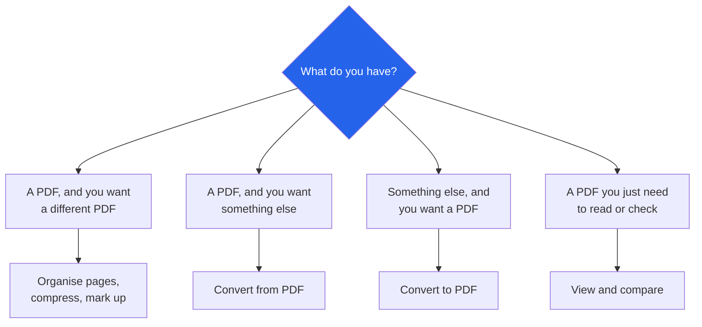

# Randomly.online PDF Tools

**42 PDF tools. Merge, split, convert, sign and protect. Nothing uploaded.**

[Open all PDF tools](https://randomly.online/pdf-tools/all-pdf-tools) &nbsp;|&nbsp; [Main README](README.md) &nbsp;|&nbsp; [randomly.online](https://randomly.online)

---

## What are the Randomly.online PDF tools?

They are 42 browser-based tools for working with PDF files: combining and splitting them, converting to and from other formats, compressing, signing, stamping, protecting and reading. Every one of them runs in the tab. The file is read from your disk by the browser, changed in memory, and written back out as a download.

PDF is the category where the privacy argument stops being abstract. The files people convert are bank statements, payslips, contracts, medical letters and passport scans. A conventional online PDF tool takes that file, copies it to a server, does the job there and gives you a link, and the copy stays for as long as the retention policy says. Here there is no copy, because there is no server to hold one.

The document work is done by [pdf-lib](https://pdf-lib.js.org/) for writing and [pdf.js](https://mozilla.github.io/pdf.js/) for reading and rendering, both served from this site's own origin. Scanned pages are read with OCR in the tab. Nothing in that chain makes a network request carrying your document.

**Last verified: 4 September 2026.** All 42 links below returned HTTP 200 on that date.

---

## Which tool do I need?

---

## Organising pages

| Tool | What it does |
|---|---|
| [Merge PDF](https://randomly.online/pdf-tools/merge-pdf) | Combine several PDFs into one, dragging to set the order |
| [Split PDF](https://randomly.online/pdf-tools/split-pdf) | Extract chosen pages, or separate every page into its own file or a ZIP |
| [Split PDF by Size](https://randomly.online/pdf-tools/split-pdf-using-size) | Break a large PDF into chunks under a target size, for a 25 MB mail limit |
| [Extract PDF Pages](https://randomly.online/pdf-tools/extract-pdf-pages) | Pull specific pages into a new file, by selection or a range like 1, 3, 5-10 |
| [Rearrange PDF Pages](https://randomly.online/pdf-tools/rearrange-pdf-pages) | Reorder by dragging thumbnails, reverse the order, or delete pages |
| [Rotate PDF](https://randomly.online/pdf-tools/rotate-pdf) | Rotate one page, a range or the whole file, and save the rotation permanently |
| [PDF Cropping Tool](https://randomly.online/pdf-tools/crop-pdf) | Trim margins and white space with a visual box or exact sizes |
| [Resize PDF Pages](https://randomly.online/pdf-tools/resize-pdf) | Change page size to A4, Letter, Legal, A3, A5 or square, and choose how content fits |

A note on rotation, because it catches people out. Most PDF readers rotate the view and forget it when the file is closed. This one writes the rotation into the document, so the page opens the right way up for whoever you send it to.

---

## Converting to PDF

| Tool | From |
|---|---|
| [Image to PDF Converter](https://randomly.online/pdf-tools/image-to-pdf-converter) | JPG, PNG, GIF and WebP, with page size and drag ordering |
| [Convert Multiple Images to PDF](https://randomly.online/pdf-tools/convert-multiple-images-into-a-single-pdf) | A batch of images into one document |
| [PNG to PDF](https://randomly.online/pdf-tools/png-to-pdf) | PNG and JPG, including a background colour for transparency |
| [WebP to PDF](https://randomly.online/pdf-tools/webp-to-pdf) | WebP, animated files included |
| [HEIC to PDF](https://randomly.online/pdf-tools/heic-to-pdf) | iPhone HEIC photos, into a file that opens anywhere |
| [Long Screenshot to PDF](https://randomly.online/pdf-tools/long-screenshot-to-pdf) | One tall screenshot cut into clean pages |
| [Excel to PDF](https://randomly.online/pdf-tools/excel-to-pdf) | XLSX and XLS, choosing sheets and fitting columns to the page |
| [Text to PDF](https://randomly.online/pdf-tools/txt-to-pdf) | TXT files or pasted text, with font, size and spacing |
| [Markdown to PDF](https://randomly.online/pdf-tools/markdown-to-pdf) | GitHub Flavored Markdown with a live preview |
| [JSON to PDF](https://randomly.online/pdf-tools/json-to-pdf) | JSON as a table, tree, report or raw view |
| [HTML to PDF](https://randomly.online/pdf-tools/html-to-pdf) | Pasted or uploaded HTML with CSS and page break control |

---

## Converting from PDF

| Tool | To |
|---|---|
| [PDF to Word](https://randomly.online/pdf-tools/pdf-to-word) | An editable DOCX, with headings, tables and scanned pages handled |
| [PDF to Text](https://randomly.online/pdf-tools/pdf-to-text) | TXT, DOCX, JSON or a ZIP, with OCR for scans |
| [PDF to HTML](https://randomly.online/pdf-tools/pdf-to-html) | HTML, either laid out as printed or reflowable |
| [PDF to JPG](https://randomly.online/pdf-tools/pdf-to-jpg) | Page images, one page or all as a ZIP, with quality and resolution control |
| [Extract Text from PDF](https://randomly.online/pdf-tools/extract-text-from-pdf) | Text from selected pages, with OCR in several languages |
| [Extract Images from PDF](https://randomly.online/pdf-tools/extract-images-from-pdf) | The embedded images at their original resolution |

Two of these deserve an honest caveat. A PDF stores glyphs at positions, not paragraphs, so converting to Word or HTML means inferring the structure back: which runs are headings, where a table's cells are, which line breaks were the layout rather than the text. The tools do that inference and get most documents right. A heavily designed page, a multi-column journal article or a form will need tidying afterwards, wherever you convert it.

---

## Making a PDF smaller

| Tool | What it does |
|---|---|
| [Compress PDF](https://randomly.online/pdf-tools/compress-pdf) | Reduce overall size with an adjustable quality setting |
| [Compress Images inside PDF](https://randomly.online/pdf-tools/compress-images-inside-pdf) | Compress only the pictures so the text stays sharp |
| [Remove Images from PDF](https://randomly.online/pdf-tools/remove-images-from-pdf) | Strip all or selected images and keep the text |
| [PDF to Grayscale](https://randomly.online/pdf-tools/pdf-to-grayscale) | Convert to grey to save ink and shrink the file |

Almost all the weight in a large PDF is images. If a file is over an email limit, compressing the images or dropping them is usually the difference, and text-only documents barely move whatever you do.

---

## Signing, stamping and protecting

| Tool | What it does |
|---|---|
| [Sign PDF](https://randomly.online/pdf-tools/sign-pdf) | Draw, type or upload a signature and place it on any page |
| [Add Stamp to PDF](https://randomly.online/pdf-tools/add-stamp-to-pdf) | Build an APPROVED or OFFICIAL round stamp, or use your own seal |
| [Protect PDF with Password](https://randomly.online/pdf-tools/protect-pdf-with-password) | AES-256 encryption, an open password, and printing or copying restrictions |
| [Unlock PDF](https://randomly.online/pdf-tools/unlock-pdf) | Remove the password from a file you can already open |
| [Flatten PDF Form Fields](https://randomly.online/pdf-tools/flatten-pdf-form-fields) | Lock filled fields, checkboxes and signatures into read-only content |
| [Edit PDF Metadata](https://randomly.online/pdf-tools/edit-pdf-metadata) | Change title, author, subject and keywords, or scrub them entirely |

Signing and unlocking are the two jobs where uploading is worst and most common. A signature page is identity, and an unlock is by definition a document you did not want open. Both run here without the file leaving the tab, which is the only version of these tools that makes sense.

---

## Watermarks, numbers, headers and footers

| Tool | What it does |
|---|---|
| [Add Watermark to PDF](https://randomly.online/pdf-tools/add-watermark-to-pdf) | Text or logo, with opacity, rotation, tiling and page selection |
| [Remove Watermark from PDF](https://randomly.online/pdf-tools/remove-watermark-from-pdf) | Erase a mark by drawing a box, or detect it and repeat across pages |
| [Add Page Numbers to PDF](https://randomly.online/pdf-tools/add-page-number-to-pdf) | Position, format as 1, 01 or Roman, and "Page X of Y" |
| [Add Header and Footer to PDF](https://randomly.online/pdf-tools/add-header-footer-to-pdf) | Page numbers, totals, dates and filenames through placeholders |

---

## Reading and comparing

| Tool | What it does |
|---|---|
| [PDF Viewer](https://randomly.online/pdf-tools/pdf-viewer) | Open any PDF with search, thumbnails, zoom and fullscreen |
| [Dark Mode PDF Viewer](https://randomly.online/pdf-tools/pdf-dark-mode) | Invert colours, tune brightness and contrast, and save the dark copy |
| [Compare PDF](https://randomly.online/pdf-tools/compare-pdf) | Two files side by side with added, deleted, changed and moved content marked |

---

## How big a file can it handle?

Bigger than most people expect, and the limit is your machine rather than a plan. There is no size cap in the tools, no queue and no daily allowance, because none of those things exist without a server to ration.

What does bound it is memory. The browser holds the source document, the working copy and the output at once, so a 200 MB scanned PDF on a laptop with little free RAM can slow down or fail where a desktop finishes it. Splitting a very large file first, then working on the parts, is the practical answer. OCR is the slowest operation here by a distance, since it renders each page and reads it, so a long scanned document takes minutes rather than seconds.

---

## Why is nothing watermarked or limited to three files a day?

Those limits exist to pay for server time. A conventional PDF service rents machines that receive, process and store your files, and the free tier is the sales funnel that covers it. Here the processing happens on hardware you already own, so the cost of your hundredth merge this week is the same as the first: nothing.

---

## Other categories

[Image](https://randomly.online/image-tools/all-image-tools) &nbsp;|&nbsp; [Text](https://randomly.online/text-tools/all-text-tools) &nbsp;|&nbsp; [Developer](https://randomly.online/dev-tools/all-development-tools) &nbsp;|&nbsp; [Date and time](https://randomly.online/date-time-tools/all-date-time-tools) &nbsp;|&nbsp; [Calculators](https://randomly.online/calculator-tools/all-calculator-tools) &nbsp;|&nbsp; [Converters](https://randomly.online/converter-tools/all-converter-tools) &nbsp;|&nbsp; [Excel](https://randomly.online/excel-tools/all-excel-tools) &nbsp;|&nbsp; [SEO](https://randomly.online/seo-tools/all-seo-tools) &nbsp;|&nbsp; [Random generators](https://randomly.online/random-generator-tools/all-random-generators)
