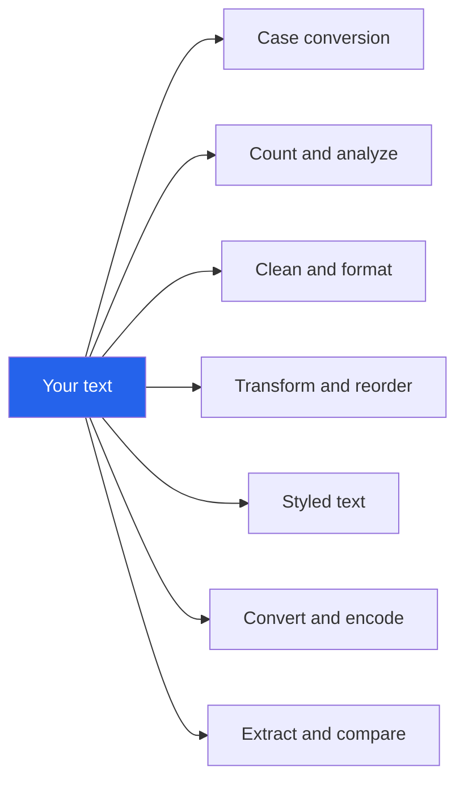

# Randomly.online Text Tools

**60 text tools in 7 groups. Paste, transform, copy. Nothing uploaded.**

[Open all text tools](https://randomly.online/text-tools/all-text-tools) &nbsp;|&nbsp; [Main README](README.md) &nbsp;|&nbsp; [randomly.online](https://randomly.online)

---

## What are the Randomly.online text tools?

They are 60 tools for changing, counting, cleaning and converting text, arranged in seven groups with a hub page each. Paste text in, get the result, copy it out. The work happens in JavaScript in your tab, so what you paste is never transmitted and nothing is stored once the tab closes.

That matters more here than the tools look like it should. People paste drafts of contracts, medical notes, customer lists, unreleased copy and API keys into a word counter without thinking about it, because a word counter feels harmless. It is only harmless if the text stays on your machine.

**Last verified: 4 September 2026.** All 67 links below returned HTTP 200 on that date.

---

## The seven groups

| Group | Tools | Hub |
|---|---:|---|
| Case conversion | 10 | [case-conversion](https://randomly.online/text-tools/case-conversion) |
| Count and analyze | 8 | [count-analyze](https://randomly.online/text-tools/count-analyze) |
| Clean and format | 8 | [clean-format](https://randomly.online/text-tools/clean-format) |
| Transform and reorder | 9 | [transform-reorder](https://randomly.online/text-tools/transform-reorder) |
| Styled text | 10 | [styled-text](https://randomly.online/text-tools/styled-text) |
| Convert and encode | 11 | [convert-encode](https://randomly.online/text-tools/convert-encode) |
| Extract and compare | 4 | [extract-compare](https://randomly.online/text-tools/extract-compare) |

---

## Case conversion

| Tool | What it does |
|---|---|
| [Case Converter](https://randomly.online/text-tools/case-conversion/case-converter) | Every case in one place, including alternating |
| [Uppercase Converter](https://randomly.online/text-tools/case-conversion/uppercase-converter) | Text to UPPERCASE |
| [Lowercase Converter](https://randomly.online/text-tools/case-conversion/lowercase-converter) | Text to lowercase |
| [Title Case Converter](https://randomly.online/text-tools/case-conversion/title-case-converter) | Headline case under AP, Chicago, APA or MLA rules |
| [Sentence Case Converter](https://randomly.online/text-tools/case-conversion/sentence-case-converter) | First letter of each sentence up, the rest down |
| [Capitalize Each Word](https://randomly.online/text-tools/case-conversion/capitalize-words) | Every word capitalized, with no style-guide exceptions |
| [Alternating Case Converter](https://randomly.online/text-tools/case-conversion/alternating-case-converter) | aLtErNaTiNg case, the mocking meme style |
| [Invert Case Converter](https://randomly.online/text-tools/case-conversion/invert-case-converter) | Swap the case of every letter, for a stuck caps lock |
| [camelCase Converter](https://randomly.online/text-tools/case-conversion/camelcase-converter) | camelCase and PascalCase for identifiers |
| [snake_case Converter](https://randomly.online/text-tools/case-conversion/snake-case-converter) | snake_case, kebab-case, CONSTANT_CASE and dot.case |

Title case is the one with a real answer rather than a preference. AP, Chicago, APA and MLA disagree about which short words stay lowercase and where a hyphenated compound capitalizes, so the tool implements the four rule sets separately instead of capitalizing everything over three letters.

---

## Count and analyze

| Tool | What it does |
|---|---|
| [Count and Analyze Text](https://randomly.online/text-tools/count-analyze) | Words, characters, sentences, lines, paragraphs, frequency and readability together |
| [Word Counter](https://randomly.online/text-tools/count-analyze/word-counter) | Live word count with reading time and limit presets |
| [Character Counter](https://randomly.online/text-tools/count-analyze/character-counter) | With and without spaces, with presets for X, Instagram, SMS and meta descriptions |
| [Sentence Counter](https://randomly.online/text-tools/count-analyze/sentence-counter) | Sentence count, average length, longest and shortest |
| [Paragraph Counter](https://randomly.online/text-tools/count-analyze/paragraph-counter) | Paragraph count and average words per paragraph |
| [Line Counter](https://randomly.online/text-tools/count-analyze/line-counter) | Total lines, or only the non-empty ones |
| [Word Frequency Counter](https://randomly.online/text-tools/count-analyze/word-frequency-counter) | Ranked word counts with stopword filtering and CSV export |
| [Reading Time Calculator](https://randomly.online/text-tools/count-analyze/reading-time-calculator) | Time to read and to speak aloud, at an adjustable speed |
| [Readability Score Checker](https://randomly.online/text-tools/count-analyze/readability-score-checker) | Flesch Reading Ease, Flesch-Kincaid grade, and the hard sentences marked |

---

## Clean and format

| Tool | What it does |
|---|---|
| [Remove Extra Spaces](https://randomly.online/text-tools/clean-format/remove-extra-spaces) | Collapse repeated spaces and trim stray whitespace |
| [Trim Each Line](https://randomly.online/text-tools/clean-format/trim-each-line) | Strip leading or trailing whitespace line by line |
| [Tabs to Spaces Converter](https://randomly.online/text-tools/clean-format/tabs-to-spaces-converter) | Tabs to spaces or back, at a chosen width |
| [Remove Line Breaks](https://randomly.online/text-tools/clean-format/remove-line-breaks) | Join text into one block, optionally keeping paragraph breaks |
| [Remove Empty Lines](https://randomly.online/text-tools/clean-format/remove-empty-lines) | Drop blank lines or collapse runs of them |
| [Remove Duplicate Lines](https://randomly.online/text-tools/clean-format/remove-duplicate-lines) | Keep unique lines, with case and trim options |
| [Remove Duplicate Words](https://randomly.online/text-tools/clean-format/remove-duplicate-words) | All repeats, or only accidental ones like "the the" |
| [Remove Punctuation](https://randomly.online/text-tools/clean-format/remove-punctuation) | Strip punctuation, with marks you choose to keep |

Text copied out of a PDF or an email client arrives with hard line breaks in the middle of sentences, non-breaking spaces that look ordinary, and indentation made of tabs. Those four removal tools exist because that is one job in four steps.

---

## Transform and reorder

| Tool | What it does |
|---|---|
| [Sort Text Lines](https://randomly.online/text-tools/transform-reorder/sort-text-lines) | Alphabetical, numeric or by length, with dedupe |
| [Shuffle Lines](https://randomly.online/text-tools/transform-reorder/shuffle-lines) | Unbiased random order, from the browser's crypto source |
| [Reverse Line Order](https://randomly.online/text-tools/transform-reorder/reverse-lines) | Flip a list top to bottom |
| [Reverse Word Order](https://randomly.online/text-tools/transform-reorder/reverse-words) | Words backwards, each word still readable |
| [Reverse Text](https://randomly.online/text-tools/transform-reorder/reverse-text) | Characters backwards, with emoji kept intact |
| [Add Line Numbers](https://randomly.online/text-tools/transform-reorder/add-line-numbers) | Numbering with a custom start, separator and padding |
| [Add Prefix and Suffix to Lines](https://randomly.online/text-tools/transform-reorder/add-prefix-suffix-to-lines) | Wrap every line in quotes, tags or commas |
| [Find and Replace Text](https://randomly.online/text-tools/transform-reorder/find-and-replace-text) | Case sensitivity, whole words and optional regex |
| [Text Repeater](https://randomly.online/text-tools/transform-reorder/text-repeater) | Repeat text a set number of times, with a separator |

Reversing text is a good example of a tool that is trivial and usually wrong. Reversing a JavaScript string character by character splits emoji, flags and accented letters into their component code units and produces rubbish. This one walks the text by grapheme, so an emoji comes back whole.

---

## Styled text

Unicode look-alike letters, for places that will not let you format: bios, posts, spreadsheet cells, chat.

| Tool | What it does |
|---|---|
| [Fancy Text Generator](https://randomly.online/text-tools/styled-text/fancy-text-generator) | Dozens of styles at once, to pick from |
| [Cursive Text Generator](https://randomly.online/text-tools/styled-text/cursive-text-generator) | Script style |
| [Bold Text Generator](https://randomly.online/text-tools/styled-text/bold-text-generator) | Bold and bold italic |
| [Strikethrough Text Generator](https://randomly.online/text-tools/styled-text/strikethrough-text-generator) | Crossed out or underlined |
| [Small Caps Generator](https://randomly.online/text-tools/styled-text/small-caps-generator) | Uppercase shapes at lowercase size |
| [Upside-Down Text Generator](https://randomly.online/text-tools/styled-text/upside-down-text-generator) | Rotated 180 degrees |
| [Zalgo Text Generator](https://randomly.online/text-tools/styled-text/zalgo-text-generator) | Glitch text with adjustable intensity |
| [Bubble Text Generator](https://randomly.online/text-tools/styled-text/bubble-text-generator) | Circled and squared letters |
| [Bionic Reading Converter](https://randomly.online/text-tools/styled-text/bionic-reading-converter) | First part of each word bolded as a reading aid |
| [ASCII Art Text Generator](https://randomly.online/text-tools/styled-text/ascii-art-text-generator) | Figlet-style banners for terminals and READMEs |

Worth knowing before you paste one into a heading: these are separate Unicode characters, not styling. Screen readers announce them awkwardly or skip them, and search engines index them as the odd characters they are. Fine for a bio, bad for a page title.

---

## Convert and encode

| Tool | What it does |
|---|---|
| [Remove HTML Tags](https://randomly.online/text-tools/convert-encode/remove-html-tags) | Strip markup to plain text, decoding entities |
| [Text to Slug](https://randomly.online/text-tools/convert-encode/text-to-slug) | A title to a lowercase hyphenated URL slug |
| [Remove Accents](https://randomly.online/text-tools/convert-encode/remove-accents) | Diacritics folded to plain ASCII |
| [Unicode Character Inspector](https://randomly.online/text-tools/convert-encode/unicode-character-inspector) | Code point, name, category and UTF-8 bytes, and invisible characters found |
| [Text to ASCII Codes](https://randomly.online/text-tools/convert-encode/text-to-ascii-codes) | Decimal or hex character codes, both directions |
| [Morse Code Translator](https://randomly.online/text-tools/convert-encode/morse-code-translator) | Both directions, with audio playback |
| [NATO Phonetic Alphabet Converter](https://randomly.online/text-tools/convert-encode/nato-phonetic-alphabet-converter) | Alpha, Bravo, Charlie, for spelling things on a call |
| [ROT13 and Caesar Cipher](https://randomly.online/text-tools/convert-encode/rot13-caesar-cipher) | Letter-shift ciphers for puzzles and learning |
| [Number to Words Converter](https://randomly.online/text-tools/convert-encode/number-to-words-converter) | Digits to words, with a currency mode for cheques |
| [Words to Numbers Converter](https://randomly.online/text-tools/convert-encode/words-to-numbers-converter) | "two hundred and five" back to 205 |
| [Roman Numeral Converter](https://randomly.online/text-tools/convert-encode/roman-numeral-converter) | Both directions, with validation |

ROT13 and the Caesar shift are labelled on the page as puzzles rather than security, and that label is the point. A shift cipher is broken by trying 25 alternatives. Nothing here should be used to protect anything.

The Unicode inspector is the practical one. Text pasted from a website, a chat client or a document often carries zero-width joiners, non-breaking spaces or soft hyphens that break a search, a database import or a filename, and are by definition invisible until something inspects them.

---

## Extract and compare

| Tool | What it does |
|---|---|
| [Text Diff Checker](https://randomly.online/text-tools/extract-compare/text-diff-checker) | Two texts compared at line and word level |
| [Compare Two Lists](https://randomly.online/text-tools/extract-compare/compare-two-lists) | Items in both, in one only, or combined, with counts |
| [Extract Emails and URLs](https://randomly.online/text-tools/extract-compare/extract-emails-urls) | Email addresses, links and phone numbers pulled out and deduplicated |
| [Extract Numbers from Text](https://randomly.online/text-tools/extract-compare/extract-numbers) | Every number as a clean list, with sum and average |

---

## Is there a length limit?

No fixed one. There is no request to size, no timeout on a server and no plan tier, so the ceiling is what your browser will hold and how fast it can work through it. Ordinary documents, even long ones, are instant. Hundreds of thousands of lines will make the page think, and the analysis tools that measure frequency or readability are the heaviest because they walk the text several times.

Nothing you paste is kept. There is no history, no account and no draft saved anywhere. Reload the page and the box is empty, which is the trade for the same reason it is the guarantee.

---

## Other categories

[Image](https://randomly.online/image-tools/all-image-tools) &nbsp;|&nbsp; [PDF](https://randomly.online/pdf-tools/all-pdf-tools) &nbsp;|&nbsp; [Developer](https://randomly.online/dev-tools/all-development-tools) &nbsp;|&nbsp; [Date and time](https://randomly.online/date-time-tools/all-date-time-tools) &nbsp;|&nbsp; [Calculators](https://randomly.online/calculator-tools/all-calculator-tools) &nbsp;|&nbsp; [Converters](https://randomly.online/converter-tools/all-converter-tools) &nbsp;|&nbsp; [Excel](https://randomly.online/excel-tools/all-excel-tools) &nbsp;|&nbsp; [SEO](https://randomly.online/seo-tools/all-seo-tools) &nbsp;|&nbsp; [Random generators](https://randomly.online/random-generator-tools/all-random-generators)
